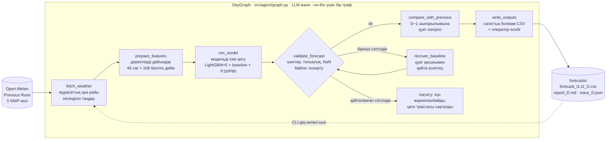
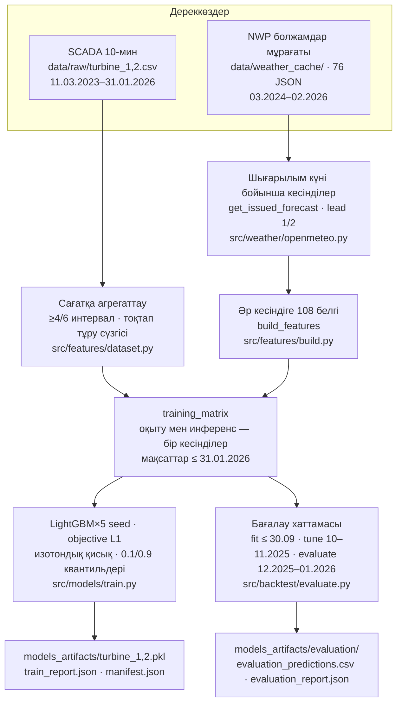

<div align="center">

[🇬🇧 English](README.md) · [🇷🇺 Русский](README.ru.md) · **🇰🇿 Қазақша**

# 🌬️ WindCast Agent

### ЖЭС өндірісін 24–48 сағат алға сағаттық болжауға арналған Agentic AI

[](requirements.txt)
[](src/models/train.py)
[](src/weather/openmeteo.py)
[](src/agent/llm.py)
[](tests/)
[](forecasts/submission.csv)
[](docker-compose.yml)

**HackAlem AI 2026 · Energy бағыты · «ЖЭС өндірісін болжауға арналған Agentic AI» кейсі · KnewIT 3 командасы**

[5 минутта тексеру](#-қазыларға-5-минутта-тексеру) ·
[Тапсырмаға сәйкестік](#-техникалық-тапсырмаға-сәйкестік-бақылау-матрицасы) ·
[Бағалау критерийлері](#-бағалау-критерийлері-бойынша) ·
[Нәтижелер](#-нәтижелер) ·
[Архитектура](#-архитектура) ·
[Іске қосу](#-іске-қосу) ·
[Құрылым](#-репозиторий-құрылымы) ·
[Шектеулер](#-шектеулер-адал) ·
[Даму](#-даму-әлеуеті-және-өзіндік-ерекшелік)

</div>

---

**WindCast Agent** — Шелек жел дәлізіндегі (Алматы облысы; координаттар техникалық тапсырмадан) екі жел
турбинасының сағаттық өндірісін болжайтын және **болжам циклін өз бетінше орындайтын** агенттік жүйе:
**мұрағаттық болжам өрістерін** алады (Open-Meteo *Previous Runs API*, 5 NWP көзі) → 108 белгі құрады →
резервтік изотондық қуат қисығы бар LightGBM×5 ансамблін іске қосады → P10–P90 аралығымен **24–48 сағатқа
сағаттық болжам** жасайды → нәтижені **тексереді және талдайды** → алдыңғы шығарылыммен салыстырады және
**сұралған әрбір күн үшін циклді қайталайды**.
Ұйымдастырушылардың тест кезеңі — **2026 жылғы 1–28 ақпан**, 31 қаңтардан бастап күнделікті шығарылымдар.
Циклді типтелген құралдары бар LLM басқарады (әдепкі бойынша OpenAI `gpt-6-luna`); дәл сол күй графы
`--no-llm` режимінде детерминацияланған түрде орындалады, сондықтан **тексеру үшін біздің API кілттеріміз де,
желі де қажет емес**.

**Ағымдағы іске асырудың шекарасы:** CLI берілген диапазондағы күндерді қайта жаңғыртады; ауа райы
жаңартуларын бақылаушы да, жоспарлаушы да жоқ. Previous Runs бірнеше прогонды біріктіреді, ал жариялау
кідірісі мәндердің бір бөлігін D күнінің соңынан кейінге шығаруы мүмкін: бүкіл кесіндінің тарихи
шығарылым сағатына қолжетімділігі **дәлелденбеген** ([ауа райы кірісінің аудиті](docs/FEATURE_AVAILABILITY.md)).

## 📌 Жоба күйі

<!-- Әр күй өзгерісінде жаңарту. «Дәлел» бағаны — сөз емес, файл немесе команда. -->

| Компонент | Күйі | Дәлел |
| --- | --- | --- |
| 2026 жылғы ақпанға тапсыру файлы (28 шығарылым, 1344 жол) | ✅ дайын | [`forecasts/submission.csv`](forecasts/submission.csv), `python -m scripts.verify_submission` |
| Екі турбинаның модельдері (LightGBM×5 + baseline + квантильдер) | ✅ дайын | [`models_artifacts/`](models_artifacts/), [`train_report.json`](models_artifacts/train_report.json) |
| Replay хаттамасы бойынша ретроспективті ансамбль бағалауы | ✅ дайын | [`models_artifacts/evaluation/`](models_artifacts/evaluation/), [`docs/EVALUATION.md`](docs/EVALUATION.md) |
| Агент күй графы: LLM және `--no-llm`, қалпына келтіру, трассалар | ✅ дайын | [`src/agent/graph.py`](src/agent/graph.py), [`tests/test_agent_graph.py`](tests/test_agent_graph.py) |
| Модельдер қайта құрылғаннан кейінгі канондық іске қосу: 28/28 трасса `mode=no-llm` | ✅ сақталған | [`forecasts/trace_*.json`](forecasts/), [шығу тегі](docs/INTEGRATION.md); есептер үлгімен жасалған, бұрынғы 28 LLM шығарылымы `4e6f7ce` git тарихында |
| Желісіз таза клоннан қайта жаңғырту | ✅ команда тексерді | [`docs/INTEGRATION.md`](docs/INTEGRATION.md#чистый-клон), [`manifest.json`](models_artifacts/manifest.json) |
| Оператор панелі (Streamlit) · тесттер `pytest tests/ -q` | ✅ 145 passed | `streamlit run app.py`, [`tests/`](tests/) |
| macOS/Linux aarch64 glibc-та желісіз қатаң тексеру, дәлдік шегі `1e-9` | ✅ тексерілген | [`docs/REPRODUCIBILITY.md`](docs/REPRODUCIBILITY.md); GitHub Actions ұйымның биллингіне байланысты бұғатталған |
| P10–P90 аралықтарын калибрлеу (қамту 64.3 %, номинал 80 %) | ⬜ ашық тапсырма | [`evaluation_report.json`](models_artifacts/evaluation/evaluation_report.json) |

## ⚡ Қазыларға: 5 минутта тексеру

Қажеттінің бәрі репозиторийде: ұйымдастырушылардың деректері, барлық ауа райы сұраныстарының кэші, оқытылған
модельдер, дайын тапсыру файлы (`--no-llm` режимінде қайта құрылған). Тәуелділіктерді орнатқаннан кейін **желі де, API
кілттері де қажет емес**: `--no-llm` режимі болжамның дәл сол сандарын береді.

```bash
python3.12 -m venv .venv && source .venv/bin/activate
pip install -r requirements.txt                       # ~1–2 мин, желі қажет жалғыз қадам

# 1) Тапсыру файлының тұтастығы: 1344 turbine-hours, [0,1], әр шығарылымға 48 сағ (27.02 — 24 сағ), әр сағатқа ең жаңа шығарылым
python -m scripts.verify_submission                   # күтілетіні: OK: 1344 turbine-hours

# 2) Қатаң тексеру: болжамдар, бағалау, manifest, канондық файлдар өзгермейді; желі бұғатталған
python -m scripts.reproduce --output-dir runs/judge-check          # дәлдік шегі 1e-9; каталог бос немесе жаңа

# 3) Тесттер және оператор панелі
python -m pytest tests/ -q                            # күтілетіні: 145 passed
streamlit run app.py -- --forecast-dir runs/judge-check              # http://localhost:8501
```

Команда 28 шығарылым, 1344 жолдық тапсыру файлы және `reproduction_report.json` жасайды; 0 коды барлық
тексерудің, соның ішінде бағалаудың 5904 жолын салыстырудың сәтті өткенін білдіреді. macOS / Linux-та
тексеру 7.3 / 11.4 с алды: болжамның ең үлкен айырмасы — 0, бағалауда — `1.11e-16`.
145 тесттің бәрі 17.05 / 17.58 с ішінде өтті. `compare_runs` — диагностика; оның 0 коды сәйкестікті кепілдемейді.
Панельде — әр түйіннің уақытымен агенттің орындалу графы, P10–P90 жолағымен сағаттық болжам,
бес NWP көзінің шашырауы, агент есебі және құрылымдық журнал. Толық бағыт: [`docs/JUDGE_GUIDE.md`](docs/JUDGE_GUIDE.md) (RU).

<details>
<summary><b>🔍 Циклдің бір күні лупамен (демо-сценарий)</b></summary>

```bash
python -m src.cli run-agent --start 2026-02-10 --end 2026-02-10 --no-llm --output-dir runs/demo
cat runs/demo/report_2026-02-10.md
python -c "import json;t=json.load(open('runs/demo/trace_2026-02-10.json'));print([(s['node'],s['status'],round(s['ms'])) for s in t['trace']])"
```

Агент **10.02.2026** күнімен белгіленген кесіндіні алады (lead 1 → 11.02, lead 2 → 12.02), 48 × 108 белгі
құрады, екі турбинаның модельдерін іске қосады, шектерді, толықтықты және NaN-ды тексереді;
flatline тек ескерту ретінде жазылады. Қуат болжамын
сол каталогта бар болса 09.02 шығарылымымен салыстырады (`mean_abs_update`, `significant_update`) және
CSV + есеп + трасса жазады. Жоғарыдағы жеке бір күндік іске қосуда алдыңғы шығарылым жоқ. Сол күннің
канондық трассасы: [`forecasts/trace_2026-02-10.json`](forecasts/trace_2026-02-10.json) — алты түйін, бәрі `ok`,
`mode=no-llm`, `completed=true`, `fallback=false`; есеп үлгімен жасалған.

</details>

## ✅ Техникалық тапсырмаға сәйкестік: бақылау матрицасы

<!-- Тапсырманың әр талабы (docs/CASE.md) → қайда іске асырылған → қалай тексеру. Жаңа функция = жаңа жол. -->

| # | Тапсырма талабы ([`docs/CASE.md`](docs/CASE.md)) | Қайда іске асырылған | Қалай көз жеткізу |
| --- | --- | --- | --- |
| 1 | Тарихи деректер негізінде сағаттық өндіріс болжау моделін құру | [`src/features/dataset.py`](src/features/dataset.py) (SCADA → сағат, тоқтап тұру сүзгісі) · [`src/features/build.py`](src/features/build.py) (108 белгі) · [`src/models/train.py`](src/models/train.py) (LightGBM×5, изотондық baseline, P10/P90 квантильдері) | `python -m src.cli train` → [`models_artifacts/train_report.json`](models_artifacts/train_report.json) |
| 2 | ЖЭС координаттары бойынша ашық көздерден **болжам жасау сәтінде қолжетімді** ауа райы болжамдарын **өз бетінше** алу | Алу және кэштеу: [`src/weather/openmeteo.py`](src/weather/openmeteo.py), `*_previous_day1/2`, координаттар [`src/config.py`](src/config.py) ішінде; `fetch_weather` кесіндіні таңдайды. **Бүкіл кесіндінің D күнінің белгіленген сағатына қолжетімділігі расталмаған** | Трассалар мен [`data/weather_cache/`](data/weather_cache/) кірісті растайды; прогондарды біріктіру мен жариялау шектеуі — [`docs/FEATURE_AVAILABILITY.md`](docs/FEATURE_AVAILABILITY.md) |
| 3 | Келесі **24–48 сағатқа сағаттық** өндіріс болжамы | `get_issued_forecast()` → әр шығарылымға 48 сағат; мұрағат шекарасында 27.02 — 24 сағат. Күнделікті CSV-де `horizon_h` 1…48, `lead_day` 1/2 бағандары | `python -m scripts.verify_submission` (соңғы шығарылым ерекшелігін қоса; тапсыруда 1344 жол) |
| 4 | **Agentic AI**: жүйе циклді өзі орындайды — *ауа райын алу → деректерді дайындау → модельді іске қосу → сағаттық болжам → нәтижені талдау → кіріс жаңарғанда қайта есептеу* | `DayGraph`: `fetch_weather → prepare_features → run_model → validate_forecast → compare_with_previous → write_outputs`, резерв `recover_baseline`; [`LLM`](src/agent/llm.py) құралдарды tool calling арқылы шақырады. CLI графты берілген күндер бойынша қайталайды; NWP жаңарғанда автоматты іске қосу жоқ | [`tests/test_agent_graph.py`](tests/test_agent_graph.py): LLM ақауы, ерте жазу, қалпына келтіру, жариялаудан бас тарту; трассалар [`forecasts/`](forecasts/) ішінде |
| 5 | Rolling хаттамасы: 31.01 → 24–48 сағ болжам, 01.02 → жаңа болжам, … бүкіл тест кезеңі бойы | `python -m src.cli run-agent --start 2026-01-31 --end 2026-02-27`; «әр сағатқа ең жаңа шығарылым» жинағы [`src/cli.py`](src/cli.py) ішіндегі `_build_submission()` | [`forecasts/`](forecasts/) ішінде 28 трасса/есеп/CSV жұбы; [`submission.csv`](forecasts/submission.csv) |
| 6 | Кейін белгілі болған нақты ауа райын емес, **мұрағаттық болжамдарды** пайдалану | Инференс тек `*_previous_dayN` көреді; өлшенген жел мен ERA5 реанализі белгілерге **кірмейді** ([`build.py`](src/features/build.py) docstring, ADR-001); оқыту мен инференс бірдей шығарылым кесінділерін пайдаланады | [`tests/test_feature_availability.py`](tests/test_feature_availability.py) (кесінділердің теңдігі мен шекаралары), `python -m src.cli check-tz`, [`docs/DECISIONS.md`](docs/DECISIONS.md#adr-001) |
| 7 | Кіріс деректері жаңарғанда қайта есептеу | CLI арқылы күндер бойынша қайталау іске асырылған. `compare_with_previous` шығарылымдар арасындағы бір сағаттардың **қуат** болжамдарын салыстырады; резерв **сол** кесіндіде физикалық қисықты пайдаланады. Ауа райы жаңартуларын бақылаушы — ашық тапсырма | [`src/cli.py`](src/cli.py), [`src/agent/tools.py`](src/agent/tools.py); трассалардағы `compare_with_previous` нәтижесі, `retried`/`fallback` |

## 🏅 Бағалау критерийлері бойынша

<!-- Бөлімдер ұйымдастырушылардың рубрикасы бойынша аталған. Әр тармақ — артефактқа сілтеме. -->

<details>
<summary><b>Тапсырмаға сәйкестік және жұмысқа қабілеттілік · 25</b></summary>

- Жоғарыдағы матрица талаптарды кодпен байланыстырады және екі ашық тармақты белгілейді: ауа райының қолжетімділік уақыты және жаңарту оқиғасы бойынша іске қосу.
- Тапсыру файлын ML-тәуелділіксіз тәуелсіз верификатор тексереді: [`scripts/verify_submission.py`](scripts/verify_submission.py).
- Толық іске қосуды команда таза клоннан **желі бұғатталған күйде** қайта жаңғыртты: барлық 1344 мән тапсыру файлымен 1e-9 дәлдікпен сәйкес келді ([`docs/INTEGRATION.md`](docs/INTEGRATION.md#чистый-клон)).
- Күн деңгейіндегі ақауға төзімділік: жарамсыз болжам → қуат қисығы бойынша бір резерв → қайта тексеру → әйтпесе күн **жарияланбайды** («үнсіз» нөлдерсіз).

</details>

<details>
<summary><b>Техникалық іске асыру · 25</b></summary>

- **Мұрағаттық ауа райы кірісі**: Previous Runs болжам өрістері қолданылады, өлшенген жел мен ERA5 инференске кірмейді. Әр мәннің тарихи жариялану уақыты жеке растауды қажет етеді.
- **MOS + қуаттың желге тәуелділігі**: LightGBM болжамдық ауа райы мен нақты қуат бойынша, олардың статистикалық байланысын ескере отырып оқытылады. Оқыту мен инференс белгілерді бірдей құрады; таралымдардың теңдігі мұнымен дәлелденбейді.
- **Бес NWP көзі** (ECMWF IFS, NCEP GFS, DWD ICON, UKMO, Open-Meteo best_match) + келісім/шашырау белгі ретінде; қолжетімді 10/80/100/120 м биіктіктегі жел, жылдамдық кубы, ауа тығыздығы ρ = p/(R·T), жел ығысуы, бағыт, кесінді ішіндегі лагтар/терезелер, күнтізбе, lead time. `best_match` — көзді автоматты таңдау, сондықтан бес кіріс бес тәуелсіз орталықты білдірмейді.
- **LLM қосылған режимде құралдарды басқарады және есеп құрастырады.** Бұрынғы 28 іске қосу `mode=openai`, fallback-сіз [4e6f7ce](docs/INTEGRATION.md#канонические-llm-отчёты-4e6f7ce) тарихында сақталған; GPT-6 Luna моделін автор көрсеткен, нақты model ID жазылмаған. Жаңа 28 канондық шығарылым `--no-llm` режимінде орындалған: ескі мәтіндер қайта құрылған болжамдарды сипаттамайды.
- **Агент еркін цикл емес, күй графы**: рұқсат етілген келесі құралды граф белгілейді, LLM талдайды және есеп жазады; API ақауы күнді сақталған түйіннен қайта есептеусіз жалғастырады; әр қадам `trace_*.json` ішінде.
- **Бағалау хаттамасы** fit → tune → evaluate хронологиясымен және шығарылым күндері бойынша replay ([`src/backtest/evaluate.py`](src/backtest/evaluate.py)); метрикалар сақталған CSV-ден қайта есептеледі. Мәлімделген логика = нақты логика: модуль келісімшарттары [`docs/ARCHITECTURE.md`](docs/ARCHITECTURE.md) ішінде, шешімдер мен **теріс нәтижелер** [`docs/DECISIONS.md`](docs/DECISIONS.md) ішінде (11 ADR).

</details>

<details>
<summary><b>README және қайта жаңғырту · 25</b></summary>

- Тәуелділіктер нақты нұсқаға дейін бекітілген ([`requirements.txt`](requirements.txt)); нұсқалар мен бастапқы код, деректер, модельдер, нәтижелердің SHA256-сы [`models_artifacts/manifest.json`](models_artifacts/manifest.json) ішінде.
- Деректер, ауа райы кэші (76 JSON), модельдер және тапсыру файлы коммитталған: іске қосуға желі де, кілт те қажет емес.
- Қатаң тексеру — `python -m scripts.reproduce --output-dir runs/<атау>`: болжамдар мен бағалау `1e-9` дәлдік шегімен салыстырылады, желі бұғатталған, канондық файлдар өзгермейді.
- 145 автотест: агент графы, LLM адаптерлері, CLI, бағалау хаттамасы, белгілер теңдігі, ауа райы өткізілімдері, оқыту шегі, верификатор, панель.
- Қазылар бағыты: [`docs/JUDGE_GUIDE.md`](docs/JUDGE_GUIDE.md); Docker: `docker compose up --build`.

</details>

<details>
<summary><b>Шешімнің құндылығы және қолданылуы · 15</b></summary>

- Өтінім дайындау үшін диспетчер сағаттық болжамды, P10–P90 жолағын, 24 сағаттағы нормаланған қуат қосындысын (`expected_energy_norm_24h`, толық қуаттың баламалы сағаттары) және шығарылымдар арасындағы **қуат болжамының өзгеру сигналын** (`significant_update`) алады. Энергияны МВт·сағ-қа аудару үшін турбинаның номиналды қуаты қажет.
- Агент есебі ML-инженерге емес, операторға арналып жазылған; панель болжамның *неге* дәл осындай екенін көрсетеді (NWP көздерінің шашырауы, тексеру күйі).
- Бірінші күннің ретроспективті бағалауында MAE номиналдың 15.8 %-ын құрайды; baseline-мен салыстыру және рұқсат етілген мақсаттар маскасы төменде келтірілген.
- Жұмыс прототипі replay мен жеке күнді іске қосуды біріктіреді; пайдалану кірістердің жариялану уақытын тексеруді, жоспарлаушыны, сапа мониторингін және аралықтарды калибрлеуді қажет етеді.

</details>

<details>
<summary><b>Даму әлеуеті және өзіндік ерекшелік · 10</b></summary>

- Тәсіл: мұрағаттық болжам өрістерінде оқыту; өлшенген желмен тарихи диагностика аз қате берді және ауа райы кірісін зерттеуге түрткі болды. Ол қате себептерінің үлесін немесе регрессордың оңтайлылығын анықтамайды ([зерттеу](docs/RESEARCH.md#source-diagnostics)).
- Фреймворктың орнына айқын ауысулары бар граф — тексерілетін, қайта жаңғыртылатын, қалпына келтіруі бар.
- Болашақ эксперименттердің жол картасы: [төменде](#-даму-әлеуеті-және-өзіндік-ерекшелік).

</details>

## 📊 Нәтижелер

### Дайын тапсыру файлы: 2026 жылғы ақпан


`forecasts/submission.csv` — 1344 жол (`turbine, datetime, lead_day, power_pred`), уақыт деректер жинағындағыдай
Asia/Almaty шкаласында. Әр сағатқа ең жаңа қолжетімді шығарылымның болжамы алынған, сондықтан тапсыруда
`lead_day = 1`; сол сағаттардың lead-2 болжамдары күнделікті CSV-де және қуат өзгерістерін салыстыруға
қолданылады. Айдағы орташа болжамдық жүктеме: T1 0.465, T2 0.462 номинал.

### Ретроспективті ансамбль бағалауы (адал сандар)


Бағалау ансамблі **30.11.2025** дейінгі мақсаттарда оқытылып, **01.12.2025–31.01.2026** кезеңінде тапсыру
файлымен бірдей жолмен тексерілді (`get_issued_forecast → build_features → predict`). Кесте **`clean_targets`**
қолданады: 6 он минуттық санаудың ≥4-і бар және эвристикалық түрде анықталған тоқтап тұруы жоқ белгілі
мақсаттар ([ережелер](docs/DATA.md)). Нормаланған қуаттың MAE: 0.158 = орнатылған қуаттың 15.8 % орташа қатесі.

| Турбина | Көкжиек | Ансамбль MAE | Baseline MAE | RMSE | Сағат-шығарылым |
| --- | --- | --- | --- | --- | --- |
| 1 | 0–24 сағ | **0.1581** | 0.1776 | 0.2347 | 1468 |
| 1 | 24–48 сағ | **0.1733** | 0.1923 | 0.2570 | 1444 |
| 2 | 0–24 сағ | **0.1581** | 0.1792 | 0.2351 | 1438 |
| 2 | 24–48 сағ | **0.1743** | 0.1940 | 0.2593 | 1414 |

**5904 жол** сақталған, бірде-бір шығарылым жоғалмаған; 01.12 күнгі 48 lead-2 жолы алынып тасталды, өйткені
олардың шығарылымы оқыту шегінен бұрын болар еді. P10–P90 қамтуы — номиналды 80 % орнына **64.3 %**: аралықтар
әзірге тар, бұл ашық тапсырма. Барлық бақыланған сағаттардағы (тоқтап тұруды қоса) метрикалар —
[`evaluation_report.json`](models_artifacts/evaluation/evaluation_report.json) ішінде.

> **Маңызды ескерту.** Желтоқсан–қаңтар бұрын көздерді таңдауға және баптауға әсер еткен, сондықтан бұл
> *ретроспективті* бағалау, қол тимеген тест емес. **Командада 2026 жылғы ақпанның нақты деректері жоқ** —
> ұйымдастырушылар тестіндегі дәлдікті біз ойдан шығармаймыз.

<details>
<summary><b>📈 Баптау кезеңіндегі қуат қисығы және LightGBM</b></summary>


| Модель | 1-турбина | 2-турбина |
| --- | --- | --- |
| Қуат қисығы (изотондық) | 0.1849 | 0.1865 |
| **Баптауға арналған жеке LightGBM** | **0.1642** | **0.1665** |

Дереккөз: ағымдағы [`train_report.json`](models_artifacts/train_report.json), баптау кезеңі **12.2025–01.2026**.
Бұл метрикалар ерте тоқтату мен салмақты таңдауға қолданылған; олар 31.01.2026 дейін қайта оқытылған соңғы
ансамбльді бағаламайды. Сақталған LightGBM салмағы екі турбинада да 1.0: қуат қисығы baseline және резерв
болып қалады. Тарихи persistence мен оракул шектеулерімен [`docs/RESEARCH.md`](docs/RESEARCH.md#temporal-model)
ішінде сипатталған.

</details>

<details>
<summary><b>🌍 Неге бір емес, бес NWP көзі</b></summary>


Тарихи іріктеуде төрт көздің орташасы жеке көздерге қарағанда MAE-ні төмендетті; JMA мен CMA таңдалған жиынға
кірмеді. Кеңістіктік қысым градиенттері (N/S/E/W нүктелері) тексерілген конфигурацияның нәтижесін жақсартпады
([ADR-007](docs/DECISIONS.md#adr-007)).

</details>

<details>
<summary><b>🖼️ Ретроспективті бағалаудың бір аптасы: болжам және факт</b></summary>


Сақталған `evaluation_predictions.csv` бойынша салынған (30.11.2025 дейін оқытылған модельдер, lead 1,
12.01.2026-дан жеті күн); әр күн — жеке шығарылым, сондықтан сегменттер шығарылым шекарасында үзіледі.
Соңғы модель қайта есептелмейді (`python -m scripts.plot_holdout`).

</details>

## 🧱 Архитектура

### Бір шығарылым циклі — графтың іске асырылуы



LLM (әдепкі бойынша OpenAI `gpt-6-luna`; Claude немесе NVIDIA NIM — орта айнымалылары арқылы) әр шақырудан
кейін `next_tool` алады, нәтижелерді талдайды және есеп құрастырады; рұқсат етілмеген ауысу күйді өзгертпейді.
API ақауы сол графты ағымдағы түйіннен ауа райын қайта алмай және модельді қайта іске қоспай жалғастырады —
бұл мінез-құлық тесттермен бекітілген. Қалпына келтіру **сол** мұрағаттық ауа райы шығарылымында бұрын
есептелген физикалық қисықты пайдаланады: өзгермеген кэшті қайта оқу дереккөз жаңаруы ретінде көрсетілмейді.

<details>
<summary><b>Деректер және оқыту</b></summary>



</details>

### Модульдер және келісімшарттар

| Модуль | Мақсаты | Негізгі келісімшарт |
| --- | --- | --- |
| [`src/weather/openmeteo.py`](src/weather/openmeteo.py) | Previous Runs API, JSON кэші, шығарылым кесінділері | `get_weather(start, end)` → `{model}__{var}__d{1\|2}`; `get_issued_forecast(issue_date, weather)` → 48 сағ, мұрағаттың соңғы күнінде 24 сағ |
| [`src/features/dataset.py`](src/features/dataset.py) | SCADA сағаттық агрегаттау, тоқтап тұру сүзгісі | `load_hourly(turbine)` → `power`, `target`, `wind_meas` |
| [`src/features/build.py`](src/features/build.py) | Белгілер, шығарылым стегі, мақсат шегі | `build_features(slice)`; `issued_feature_stack(weather)`; `training_matrix()` → `X, y` |
| [`src/models/train.py`](src/models/train.py) · [`predict.py`](src/models/predict.py) | fit/tune бойынша іріктеу, 5 соңғы LightGBM, baseline, квантильдер; жел жоқ болғанда NaN-мен инференс | `train_all(weather)`; `predict(turbine, features)` → `power_pred, power_baseline, power_lgb, power_p10, power_p90, lead_day` |
| [`src/agent/graph.py`](src/agent/graph.py) · [`tools.py`](src/agent/tools.py) | Күйлер, ауысулар, трасса; алты штаттық құрал, резерв + `DayContext` | `DayGraph.execute(tool, args)` → нәтиже + `next_tool`; алдыңғы шығарылымды оқу және нәтижелерді жазу |
| [`src/agent/llm.py`](src/agent/llm.py) · [`loop.py`](src/agent/loop.py) | OpenAI-үйлесімді / Anthropic адаптерлері; LLM / LLM-сіз режимде күнді іске қосу | `pick_backend()`; бір жүрісте бір құрал, 429/5xx кезінде қайталау; `run_day_llm`, `run_day_no_llm` |
| [`src/backtest/evaluate.py`](src/backtest/evaluate.py) | Ретроспективті replay, CSV/JSON, метрикаларды қайта есептеу | `--output-dir` |
| [`src/cli.py`](src/cli.py) | `train`, `run-agent`, `check-tz`, `list-models` | LLM есептерін қайта жазудан қорғау, `submission.csv` жинау |
| [`app.py`](app.py) | Оператор панелі, Streamlit + Plotly | `--forecast-dir`, `--evaluation-dir` |

Толығырақ: [`docs/ARCHITECTURE.md`](docs/ARCHITECTURE.md) (RU). Панель: `streamlit run app.py` — әр түйіннің күйі
мен уақытымен агенттің орындалу графы, P10–P90 жолағымен болжам, NWP көздерінің шашырауы, есеп және шешімдер
журналы. Екі режим: *Тест кезеңі (2026 жылғы ақпан)* `forecasts/` немесе `--forecast-dir` каталогын оқиды;
*Ретроспективті бағалау* сақталған `models_artifacts/evaluation/` болжамдарын оқиды — соңғы модель ешқашан
қайта есептелмейді ([`docs/DASHBOARD.md`](docs/DASHBOARD.md)). Аяқталмаған іске қосу жасырылады.

## 🚀 Іске қосу

<details open>
<summary><b>Жергілікті · Python 3.12+</b></summary>

```bash
python3 -m venv .venv && source .venv/bin/activate
pip install -r requirements.txt

python -m scripts.reproduce --output-dir runs/judge-check
python -m pytest tests/ -q
streamlit run app.py -- --forecast-dir runs/judge-check
```

`--output-dir` болмаса CLI `forecasts/` ішіне жазады, `--forecast-dir` болмаса панель сол жерден оқиды.
Offline режимде CLI бар LLM есептерін қорғайды; `--overwrite` оларды ауыстыруға айқын рұқсат береді.
`runs/` каталогы git-ке кірмейді.

</details>

<details>
<summary><b>Docker</b></summary>

```bash
docker compose up --build            # сақталған модельдер, оқытусыз; панель http://localhost:8501
docker compose run --rm reproduce    # желі өшірулі, дәлдік шегі 1e-9; жаңа/бос runs/reproduction-docker
```

`forecasts/` каталогы хосттан тек оқуға қосылған. Образда сақталған модельдердің екі тобы да бар;
құрастыру кезінде оқыту орындалмайды. Linux aarch64 glibc-та желі өшірілген тексеру macOS-тағыдай
`1e-9` дәлдік шегімен өтті. GitHub Actions ұйымның биллингін қалпына келтіруді күтеді
([нәтижелер](docs/REPRODUCIBILITY.md)).

</details>

<details>
<summary><b>LLM-агент режимі</b></summary>

```bash
cp .env.example .env                 # OPENAI_API_KEY (немесе ANTHROPIC_API_KEY / NVIDIA NIM), файлдағы түсініктемелерді қараңыз
python -m src.cli list-models        # кілтіңізге қандай модельдер қолжетімді
python -m src.cli run-agent --start 2026-02-10 --end 2026-02-10 --output-dir runs/llm-demo
streamlit run app.py -- --forecast-dir runs/llm-demo
```

Бэкенд басымдығы: `LLM_BACKEND` → OpenAI кілті → `ANTHROPIC_API_KEY`. Нақты LLM іске қосуында трассада
`completed=true`, `fallback=false` және таңдалған бэкендтің режимі күтіледі: OpenAI-үйлесімді API үшін
`mode=openai` немесе Claude үшін `mode=anthropic`. Кілтсіз сол граф бойынша үлгі есеп орындалады.
Кілттер — тек жергілікті `.env` ішінде (`.gitignore`-да).

</details>

<details>
<summary><b>Қосымша командалар</b></summary>

```bash
python -m src.cli train                                    # қайта оқыту → models_artifacts/ АУЫСТЫРАДЫ
python -m src.cli check-tz                                 # сағаттық ығысу диагностикасы: болжам/өлшенген жел корреляциясының максимумы
python -m src.backtest.evaluate --output-dir runs/eval     # хаттама бойынша ретроспективті бағалау
python -m scripts.compare_runs --a forecasts --b runs/x    # екі іске қосудың айырмасы
python -m src.backtest.experiments                         # кеңістіктік градиенттер (ADR-007)
python -m src.backtest.prof_ideas                          # екі сатылы калибрлеу (ADR-008)
```

Жанама әсерлерімен толық тізім: [`docs/EXPERIMENTS.md`](docs/EXPERIMENTS.md).

</details>

## 📁 Репозиторий құрылымы

```text
.
├── README.md · README.ru.md · README.kk.md   ← ағылшын (әдепкі), орыс, қазақ
├── requirements.txt              ← пакет нұсқалары бекітілген; Python 3.12.6-да тексерілген
├── Dockerfile · docker-compose.yml · .env.example
├── app.py                        ← оператор панелі (Streamlit + Plotly)
├── src/
│   ├── config.py                 ← координаттар, кезеңдер, 5 NWP көзі, ауа райы айнымалылары
│   ├── cli.py                    ← train · run-agent · check-tz · list-models
│   ├── weather/openmeteo.py      ← Previous Runs API, кэш, шығарылым күні бойынша кесінділер
│   ├── features/dataset.py       ← SCADA → сағат, тоқтап тұру сүзгісі
│   ├── features/build.py         ← 108 белгі, шығарылым стегі, training_matrix
│   ├── models/train.py · predict.py
│   ├── agent/graph.py · tools.py · llm.py · loop.py
│   └── backtest/evaluate.py · experiments.py · prof_ideas.py
├── data/
│   ├── raw/turbine_1.csv · turbine_2.csv     ← ұйымдастырушылардың деректері (10 мин, 03.2023–01.2026)
│   └── weather_cache/*.json                  ← Open-Meteo-ның 76 сақталған жауабы → offline іске қосу
├── models_artifacts/
│   ├── turbine_1.pkl · turbine_2.pkl         ← тапсыру модельдері, 31.01.2026 дейін оқытылған
│   ├── train_report.json · manifest.json     ← баптау метрикалары, нұсқалар, SHA256
│   └── evaluation/                           ← бағалау модельдері (30.11.2025 дейін), болжам CSV, метрика JSON
├── forecasts/                                ← КАНОНДЫҚ НӘТИЖЕ (тек интегратор жаңартады)
│   ├── submission.csv                        ← 1344 жол, 2026 жылғы ақпан
│   ├── forecast_t{1,2}_YYYY-MM-DD.csv        ← 28 × 2 CSV: 48 сағат; соңғы шығарылым — 24
│   ├── report_YYYY-MM-DD.md                  ← операторға үлгі есеп (--no-llm)
│   └── trace_YYYY-MM-DD.json                 ← граф трассасы: түйіндер, күйлер, уақыт, next_tool
├── scripts/verify_submission.py · compare_runs.py · plot_holdout.py
├── tests/                                    ← 145 тест
└── docs/                                     ← тапсырма, архитектура, деректер, шешімдер, бағалау, қазылар бағыты (RU)
```

**Құжаттама (RU):** [`CASE.md`](docs/CASE.md) ресми тапсырма және рубрика · [`JUDGE_GUIDE.md`](docs/JUDGE_GUIDE.md)
қазыларға қадамдық бағыт · [`DASHBOARD.md`](docs/DASHBOARD.md) панель режимдері мен дерек көздері · [`ARCHITECTURE.md`](docs/ARCHITECTURE.md) граф, оқыту, модуль келісімшарттары ·
[`DATA.md`](docs/DATA.md) деректер профилі және тазалау ережелері · [`RESEARCH.md`](docs/RESEARCH.md) ауа райы көздері
және диагностика · [`DECISIONS.md`](docs/DECISIONS.md) 11 ADR, теріс нәтижелерді қоса · [`EVALUATION.md`](docs/EVALUATION.md)
бағалау хаттамасы · [`FEATURE_AVAILABILITY.md`](docs/FEATURE_AVAILABILITY.md) мұрағат қолжетімділігі ·
[`EXPERIMENTS.md`](docs/EXPERIMENTS.md) эксперимент командалары · [`INTEGRATION.md`](docs/INTEGRATION.md) орындалған тексерулер ·
[`NEXT_STEPS.md`](docs/NEXT_STEPS.md) · [`TASKS.md`](docs/TASKS.md) · [`GIT_WORKFLOW.md`](docs/GIT_WORKFLOW.md).

**Тесттер** ([`tests/`](tests/), 145 өтеді): агент графы барлық режимде бірдей, LLM ақауы сақталған түйіннен
жалғасады, ерте жазу қабылданбайды, сәтсіз тексеру бір рет қалпына келеді немесе жариялаудан бас тартады; оқыту
белгілері сол шығарылым үшін инференс белгілеріне тең, лагтар шығарылым шекарасынан өтпейді; болашақ мақсаттар
оқытуға кірмейді; fit/tune/evaluate маскалары қиылыспайды, метрикалар CSV-ден қайта есептеледі; жоқ жел NaN күйінде
қалады; `--output-dir` оқшаулануы; тәуелсіз верификатор; панель екі режимде де көрсетіледі және аяқталмаған іске
қосуды жасырады. Жарияламас бұрын: `python -m pytest tests/ -q` · `python -m scripts.verify_submission` ·
`git diff --check`.

## 🔬 Эксперименттер және теріс нәтижелер

<!-- Жаңа гипотеза → мұнда жол + docs/DECISIONS.md ішінде ADR. Сандар — жадтан емес, артефактілерден. -->

Төмендегі сандар белгілер кесінділері түзетілгенге дейінгі тарихи ADR-ларда сақталған. Олар бұрынғы іріктеуді
сипаттайды; бұл эксперименттерді жаңадан қайта есептеуге салыстырмалы CSV репозиторийде жоқ.

| Гипотеза | Тарихи нәтиже (баптау кезеңі) | Күйі |
| --- | --- | --- |
| Кеңістіктік қысым градиенттері (N/S/E/W нүктелері ±0.5°) | 0.1650-ге қарсы 0.1658 | Қабылданбады — [ADR-007](docs/DECISIONS.md#adr-007) |
| Екі сатылы схема: NWP → жел калибрлеуі, содан кейін қуат қисығы | 0.1650 / 0.1661-ге қарсы 0.1653 / 0.1686 | Қабылданбады — [ADR-008](docs/DECISIONS.md#adr-008) |
| Жақындағы нақты өндіріс белгілері | 0.1650 / 0.1645; айырманың маңыздылығы тексерілмеген | Қолданылмады: ақпанның нақты өндірісі жоқ — [ADR-008](docs/DECISIONS.md#adr-008) |
| JMA, CMA көздері | Жеке көздер диагностикасында corr 0.541 / 0.613 | Бұрынғы іріктеуде таңдалмады — [ADR-007](docs/DECISIONS.md#adr-007) |
| Нейрондық уақыт қатарлары моделі (LSTM/TFT) | Тікелей эксперимент болмады; persistence нейрожеліні тексермейді | Ашық кандидат — [RESEARCH §4.1](docs/RESEARCH.md#temporal-model) |
| Оркестрация фреймворкі (LangGraph және т.б.) | Ауысуларды тексеретін және трассасы бар айқын граф тесттермен қамтылған | Қабылданбады — [ADR-009](docs/DECISIONS.md#adr-009) |

Бұрынғы экспериментте калибрлеу регрессоры NWP орташасының 1.779 м/с-ына қарсы **1.801 м/с** жел MAE берді
([ADR-008](docs/DECISIONS.md#adr-008)). Бұл бір конфигурацияның нәтижесі; орташаның оңтайлылығы одан шықпайды.

## 🚧 Шектеулер (адал)

- **2026 жылғы ақпанның дәлдігі белгісіз** — факт ұйымдастырушыларда. Біздің барлық метрикамыз ретроспективті.
- Желтоқсан–қаңтар бұрын көздерді таңдауға және баптауға әсер еткен, сондықтан бағалау қол тимеген тест емес.
- **P10–P90 аралықтары фактіні толық қамтымайды** (номинал 80 %-ға қарсы 64.3 %) — оларды калибрленген 80 % аралығы деп атамау керек.
- Previous Runs әртүрлі прогондардың болжамдарын біріктіреді және әр ұяшықтың жариялану уақытын сақтамайды.
  Жариялау кідірісін ескергенде таңдалған мәндердің бір бөлігі D күнінен кейін пайда болуы мүмкін; **бүкіл**
  кесіндінің белгіленген шығарылым сағатына қолжетімділігі дәлелденбеген ([`FEATURE_AVAILABILITY`](docs/FEATURE_AVAILABILITY.md)).
- Тоқтап тұру мен қуат шектеулері ауа райы бойынша болжанбайды: модель диспетчер шешімдерін емес, **қолжетімді жел
  өндірісін** болжайды; барлық бақыланған сағаттарда метрикалар сәл өзгеше (бағалау есебіндегі `all_observed`).
- Linux aarch64 glibc жергілікті ортада желісіз, `1e-9` дәлдік шегімен тексерілді. Hosted GitHub Actions
  ұйымның биллингі бұғатталғандықтан басталмайды; жергілікті нәтиже мен CI күйі
  [`REPRODUCIBILITY`](docs/REPRODUCIBILITY.md) құжатында бөлек жазылған.
- Жоспарлаушы, NWP жаңартуларын бақылау, кіріс таралымдарының дрейфін бақылау және автоматты қайта оқыту
  іске асырылмаған; `compare_with_previous` тек қуат болжамының өзгерісін өлшейді.

## 🔭 Даму әлеуеті және өзіндік ерекшелік

<!-- Кандидаттар күтілетін ұтыс бойынша реттелген. «Орындалды» деп көшіру — тек бағалау хаттамасы бойынша өлшегеннен кейін. -->

1. **Қосымша көз ретінде нейрондық NWP.** ECMWF AIFS-ті тексеру: қажетті күндердің қамтылуы, айнымалылар және
   жариялану уақыты, содан кейін replay хаттамасы бойынша салыстыру.
2. **Аралықтарды калибрлеу**: баптау кезеңінің қалдықтары бойынша P10–P90 конформды түзетуі; мақсатты қамту 80 %.
3. **Аналогтық ансамбль (AnEn)**: ұқсас тарихи болжам жағдайларын іздеу — агент есебінде эмпирикалық анықталмағандық
   және өлшенген өндірісі бар салыстырмалы сағаттарға сілтемелер.
4. **Тірі SCADA белгілері**, егер оператор оларды тексерілетін қолжетімділік уақытымен берсе; ауа райы кірістері
   мен сапа дрейфін жеке бақылау, содан кейін автоматты қайта оқыту; P10–P90 аралығынан теңгерімдеу нарығына
   өтінім. Мұрағаттық EPS мүшелерінің қолжетімділігі мен олардың аралық сапасына үлесі жеке зерттеуді қажет етеді.

Ағымдағы нұсқада біріктірілгені: *болжамдық* ауа райында бір модельмен MOS түзетуі мен қуаттың желге тәуелділігі;
ауа райы кірісін зерттеуге түрткі болған «оракул» диагностикасы; еркін LLM циклінің орнына қалпына келтіруі мен
трассасы бар күй графы; тәуелсіз тапсыру верификаторы; әр жолдың сақталған шығу тегімен шығарылым күндері
бойынша replay хаттамасы.

## 📚 Деректер және үшінші тарап компоненттері

<!-- Регламенттің 5.4.4 ережесі: үшінші тарап кодын, модельдерін, деректерін және үлгілерін ашып көрсету. -->

- **Ұйымдастырушылардың деректер жинағы**: `data/raw/turbine_{1,2}.csv` — 11.03.2023–31.01.2026 аралығындағы 10 минуттық
  қатарлар (142 360 және 149 499 жол; 6.6 % және 1.9 % өткізілім, T1-де 2024 жылғы мамыр–маусымда 41 күндік үзіліс). Өңдеу ережелері — [`docs/DATA.md`](docs/DATA.md).
- **Геолокация** тапсырма сілтемелерінен: T1 `43.645150, 78.535604`, T2 `43.643198, 78.538828` (~300 м → бір ауа райы нүктесі, модельдер бөлек).
- **Ауа райы**: [Open-Meteo Previous Runs API](https://open-meteo.com/en/docs/previous-runs-api); сақталған іске қосу пайдаланатын жауаптар `data/weather_cache/` ішінде.
- **Кітапханалар**: pandas, NumPy, scikit-learn, LightGBM, httpx, Streamlit, Plotly, matplotlib, pytest, OpenAI-үйлесімді HTTP клиенті, anthropic SDK.
- **Өнімдегі LLM**: әдепкі модель `gpt-6-luna` (OpenAI Chat Completions, tool calling); Claude және NVIDIA NIM адаптерлері. `4e6f7ce` тарихи LLM іске қосуларының нақты model ID-і жазылмаған; ағымдағы канондық есептер — `--no-llm`.
- **Әзірлеудегі AI-көмекшілер**: хакатон ережелері бойынша OpenAI Codex CLI және Claude Code; архитектура, ML шешімдері және тексерулер — команданікі.
- Әдебиет: Glahn & Lowry (1972) MOS; Hong et al. (2016) GEFCom2014; Giebel & Kariniotakis (2017); Draxl et al. (2015) — [`docs/RESEARCH.md`](docs/RESEARCH.md#5-литература-исходного-исследования).

<details>
<summary><b>🧭 Бұл README-ді қалай кеңейту · 📝 Өзгерістер журналы</b></summary>

Жоба дамуын жалғастыруда; түзетулер жергілікті болып қалуы керек:

- **Компонент күйі өзгерді** → артефактқа сілтемесі бар [Жоба күйіндегі](#-жоба-күйі) бір жол (✅ / 🔄 / ⬜).
- **Тапсырма бойынша жаңа функция** → [бақылау матрицасындағы](#-техникалық-тапсырмаға-сәйкестік-бақылау-матрицасы) жол: талап → файл → тексеру командасы.
- **Агенттің жаңа құралы** → [цикл диаграммасындағы](#бір-шығарылым-циклі--графтың-іске-асырылуы) түйін және [`src/agent/graph.py`](src/agent/graph.py) ішіндегі `NODES`/`EDGES` жазбасы.
- **Жаңа NWP көзі немесе белгі** → [`src/config.py`](src/config.py) ішіндегі `WEATHER_MODELS`/`WEATHER_VARS`, `src.backtest.evaluate` қайта бағалау, нәтижелер кестесін **`evaluation_report.json` сандарымен** жаңарту.
- **Тексерілген гипотеза** → [эксперименттердегі](#-эксперименттер-және-теріс-нәтижелер) жол + [`docs/DECISIONS.md`](docs/DECISIONS.md) ішіндегі ADR, нәтиже теріс болса да.
- **Графиктер** — `docs/img/` ішіндегі SVG, сақталған CSV/JSON-нан скриптпен жасалады (қолмен емес). Үш тілдік файл құрылымы бойынша бірдей: бөлім үшеуінде де аударылады немесе ешқайсысында да.

| Күні | Өзгеріс |
| --- | --- |
| 23.09.2026 | Толық конвейер: Previous Runs, белгілер, LightGBM + baseline, агент, CLI |
| 23.09.2026 | Көздер диагностикасы, 5 NWP моделін іріктеу, градиенттер бойынша теріс нәтиже |
| 23.09.2026 | P10/P90 квантильдері, ақпанның толық іске қосылуы, тәуелсіз тапсыру верификаторы |
| 23.09.2026 | LLM/offline бірыңғай күй графы, қалпына келтіру, іске қосуларды оқшаулау |
| 23.09.2026 | Шығарылым кесінділері бойынша белгілер, ретроспективті бағалау хаттамасы, желісіз таза клон |
| 23.09.2026 | `4e6f7ce` тарихи LLM іске қосуы: 28/28 трасса `mode=openai`; GPT-6 Luna авторымен көрсетілген; бұрынғы жинақ git тарихында сақталған |
| 23.09.2026 | Панель модельді қайта есептеудің орнына сақталған ретроспективті бағалауды көрсетеді; 145 тест |
| 23.09.2026 | Белгілер 10 ондық таңбаға дөңгелектенеді; модельдердің екі тобы және болжамдар қайта құрылған; macOS/Linux қатаң replay `1e-9`, 28 жаңа есеп `--no-llm` |
| 23.09.2026 | Қазыларға арналған EN/RU/KK README: бақылау матрицасы, артефактілерден графиктер, жоба күйі; аудит бойынша тұжырымдар түзетілді |

</details>

## 👥 Команда

**KnewIT 3** — 3 әзірлеуші. Жұмыс бөлінісі: [`docs/TASKS.md`](docs/TASKS.md); git процесі және іске қосу иесі ережесі:
[`docs/GIT_WORKFLOW.md`](docs/GIT_WORKFLOW.md). Репозиторий: <https://github.com/BAITC-Hacks/hack-f0ab74e4-knewit-3>.
