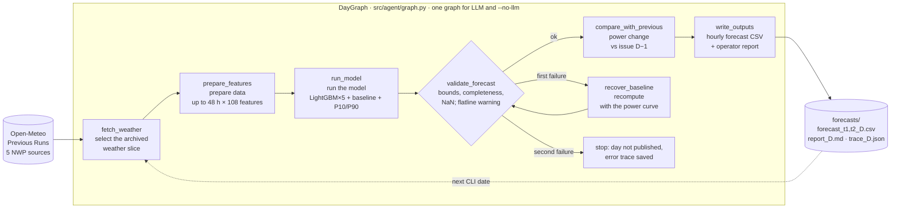
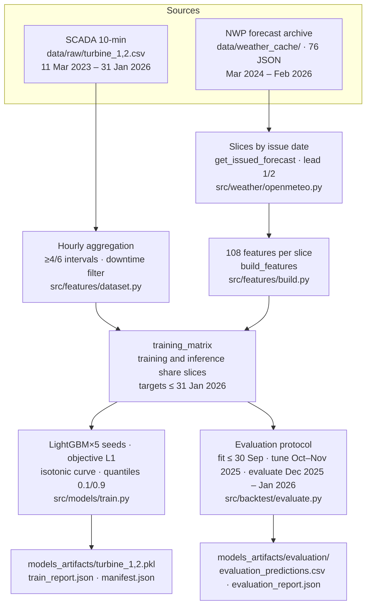

<div align="center">

**🇬🇧 English** · [🇷🇺 Русский](README.ru.md) · [🇰🇿 Қазақша](README.kk.md)

# 🌬️ WindCast Agent

### Agentic AI for hourly wind-farm power forecasting, 24–48 hours ahead

[](requirements.txt)
[](src/models/train.py)
[](src/weather/openmeteo.py)
[](src/agent/llm.py)
[](tests/)
[](forecasts/submission.csv)
[](docker-compose.yml)

**HackAlem AI 2026 · Energy track · case "Agentic AI for wind-farm generation forecasting" · team KnewIT 3**

[Verify in 5 minutes](#-for-judges-verify-in-5-minutes) ·
[Brief compliance](#-brief-compliance-traceability-matrix) ·
[Scoring criteria](#-against-the-scoring-criteria) ·
[Results](#-results) ·
[Architecture](#-architecture) ·
[Running](#-running) ·
[Structure](#-repository-structure) ·
[Limitations](#-limitations-honest) ·
[Roadmap](#-development-potential-and-originality)

</div>

---

**WindCast Agent** forecasts the hourly output of two wind turbines in the Shelek wind corridor
(Almaty region, Kazakhstan; coordinates from the brief) and **runs the forecasting cycle autonomously**:
fetch **archived forecast fields** (Open-Meteo *Previous Runs API*, 5 NWP sources) → build 108 features →
run a LightGBM×5 ensemble with an isotonic power curve kept as a fallback → produce an **hourly 24–48 h forecast**
with a P10–P90 band → **validate and analyse** the result → compare with the previous issue and
**repeat the cycle for every requested date**.
The organisers' test period is **1–28 February 2026**, rolling issues from 31 January.
An LLM with typed tools orchestrates the cycle (OpenAI `gpt-6-luna` by default); the same state graph runs
deterministically in `--no-llm` mode, so **verification needs neither our API keys nor network access**.

**Boundary of the current implementation:** the CLI replays the dates of a requested range; there is no
weather-update watcher and no scheduler. Previous Runs stitches several model runs, and publication delays can
push part of the values past the end of day D: availability of the whole slice at the historical issue hour is
**not proven** ([weather-input audit](docs/FEATURE_AVAILABILITY.md)).

## 📌 Project status

| Component | Status | Evidence |
| --- | --- | --- |
| February 2026 submission (28 issues, 1344 rows) | ✅ done | [`forecasts/submission.csv`](forecasts/submission.csv), `python -m scripts.verify_submission` |
| Models for both turbines (LightGBM×5 + baseline + quantiles) | ✅ done | [`models_artifacts/`](models_artifacts/), [`train_report.json`](models_artifacts/train_report.json) |
| Retrospective evaluation via the replay protocol | ✅ done | [`models_artifacts/evaluation/`](models_artifacts/evaluation/), [`docs/EVALUATION.md`](docs/EVALUATION.md) |
| Agent state graph: LLM and `--no-llm`, recovery, traces | ✅ done | [`src/agent/graph.py`](src/agent/graph.py), [`tests/test_agent_graph.py`](tests/test_agent_graph.py) |
| Current rebuilt bundle: 28/28 completed offline traces | ✅ saved | [`forecasts/`](forecasts/), [`manifest.json`](models_artifacts/manifest.json); the previous live LLM run remains in [Git history](https://github.com/BAITC-Hacks/hack-f0ab74e4-knewit-3/tree/4e6f7ce/forecasts) |
| Reproduction from a clean clone with network blocked | ✅ verified by the team | [`docs/INTEGRATION.md`](docs/INTEGRATION.md#чистый-клон), [`manifest.json`](models_artifacts/manifest.json) |
| Operator dashboard (Streamlit) · tests `pytest tests/ -q` | ✅ 145 passed | `streamlit run app.py`, [`tests/`](tests/) |
| Linux Docker rehearsal, network disabled, strict tolerance `1e-9` | ✅ passed locally | [`docs/REPRODUCIBILITY.md`](docs/REPRODUCIBILITY.md); GitHub Actions is blocked by organisation billing |
| P10–P90 interval calibration (coverage 64.3 % vs nominal 80 %) | ⬜ open task | [`evaluation_report.json`](models_artifacts/evaluation/evaluation_report.json) |

## ⚡ For judges: verify in 5 minutes

Everything is in the repository: the organisers' data, the cache of every weather request, trained models,
the rebuilt submission and its offline reports. After installing dependencies, **no network and
no API keys are needed** — `--no-llm` yields the same forecast numbers.

**Prerequisites:** Git access to this private repository and **Python 3.12** on Linux/macOS,
or Docker with Compose v2. Python 3.12.6 and 3.12.14 were tested; newer minor versions were not.
On macOS, LightGBM needs `brew install libomp`; on Debian/Ubuntu it needs
`sudo apt-get update && sudo apt-get install -y libgomp1`. Docker includes this library.
Installation needs internet access; the verification below then runs from the committed cache.

```bash
git clone https://github.com/BAITC-Hacks/hack-f0ab74e4-knewit-3.git
cd hack-f0ab74e4-knewit-3                              # skip clone/cd if already at the repo root
python3.12 -m venv .venv
source .venv/bin/activate
python -m pip install -r requirements.txt

# 1) Submission integrity: 1344 turbine-hours, [0,1], 48 h per issue (27 Feb — 24 h), freshest issue per hour
python -m scripts.verify_submission                   # expected: OK: 1344 turbine-hours

# 2) Offline replay, evaluation, manifest and numeric comparison (new or empty output directory)
WINDCAST_RUN_DIR="runs/judge-$(python -c 'import uuid; print(uuid.uuid4().hex[:8])')"
python -m scripts.reproduce --output-dir "$WINDCAST_RUN_DIR"

# 3) Tests and the operator dashboard
python -m pytest tests/ -q                            # expected: 145 passed
python -m streamlit run app.py -- --forecast-dir "$WINDCAST_RUN_DIR"  # http://localhost:8501
```

Run these commands in the same terminal. Each replay gets a new directory, so repeating the
check preserves previous results. The dashboard stays running until Ctrl+C; opening it is optional.

You will see 28 completed issues and eight `OK` checks, including 1344 submission rows and 5904 evaluation rows.
The dashboard shows the agent's execution graph with per-node timing, the hourly forecast with its P10–P90 band,
the spread of the five NWP sources, the agent's report and a structured log.
Step-by-step route: [`docs/JUDGE_GUIDE.md`](docs/JUDGE_GUIDE.md) (RU).

### Automated review and common setup issues

- **Headless / AI reviewer:** run `scripts.verify_submission`, `scripts.reproduce` and `pytest` above.
  A browser, `.env`, LLM key, training and live weather download are not required. Check exit codes;
  the replay writes a machine-readable `reproduction_report.json` inside `$WINDCAST_RUN_DIR`.
- **Expected evidence:** 145 tests with zero skips; eight replay checks pass; 1344 submission rows
  and 5904 evaluation rows match at `1e-9`. Reproduction proves saved-result consistency;
  accuracy is reported separately in `models_artifacts/evaluation/evaluation_report.json`.
- **Repository unavailable:** the organiser must grant your GitHub account access. An API key for
  an LLM does not grant repository access. Run all commands from the cloned repository root.
- **`libomp` / `libgomp` error:** install the system library listed above, or use Docker below.
  If dependency installation fails on Python 3.13+, recreate the environment with Python 3.12.
- **Output directory is not empty:** choose a new directory; no deletion or `--overwrite` is needed.
  Keep the supplied `data/`, `models_artifacts/` and `forecasts/` intact for verification.
- **Port 8501 is busy:** add `--server.port 8502` before the `--` in the Streamlit command.
- **Red GitHub Actions checks:** as of 23 September 2026, the organisers' organisation billing
  lock prevents runners from starting. This is not a test result. Local macOS/Linux evidence
  and repeatable commands are in [REPRODUCIBILITY](docs/REPRODUCIBILITY.md).

<details>
<summary><b>🔍 One cycle day under the microscope (demo scenario)</b></summary>

```bash
python -m src.cli run-agent --start 2026-02-10 --end 2026-02-10 --no-llm --output-dir runs/demo
cat runs/demo/report_2026-02-10.md
python -c "import json;t=json.load(open('runs/demo/trace_2026-02-10.json'));print([(s['node'],s['status'],round(s['ms'])) for s in t['trace']])"
```

The agent takes the slice labelled **10 Feb 2026** (lead 1 → 11 Feb, lead 2 → 12 Feb), builds 48 × 108 features,
runs both turbine models, validates bounds, completeness and missing values, warns about flat forecasts, compares with the
9 Feb issue if it exists in the same directory (`mean_abs_update`, `significant_update`) and writes CSV + report +
trace. In the isolated one-day run above there is no previous issue. The canonical trace of that day:
[`forecasts/trace_2026-02-10.json`](forecasts/trace_2026-02-10.json) — six nodes, all `ok`, `mode=no-llm`,
`completed=true`, `fallback=false`. The earlier live LLM reports remain in Git history; they were not reused
for the rebuilt predictions.

</details>

## ✅ Brief compliance: traceability matrix

| # | Brief requirement ([`docs/CASE.md`](docs/CASE.md)) | Implemented in | How to verify |
| --- | --- | --- | --- |
| 1 | Build a model of hourly generation from the historical data | [`src/features/dataset.py`](src/features/dataset.py) (SCADA → hourly, downtime filter) · [`src/features/build.py`](src/features/build.py) (108 features) · [`src/models/train.py`](src/models/train.py) (LightGBM×5, isotonic baseline, P10/P90 quantiles) | `python -m src.cli train` → [`models_artifacts/train_report.json`](models_artifacts/train_report.json) |
| 2 | **Autonomously** fetch weather forecasts for the site coordinates from open sources, **available at the moment of forecasting** | Fetching and caching: [`src/weather/openmeteo.py`](src/weather/openmeteo.py), `*_previous_day1/2`, coordinates from [`src/config.py`](src/config.py); `fetch_weather` selects the slice. **Availability of the whole slice at a fixed hour of day D is not confirmed** | Traces and [`data/weather_cache/`](data/weather_cache/) confirm the input; the run-stitching and publication limitation — [`docs/FEATURE_AVAILABILITY.md`](docs/FEATURE_AVAILABILITY.md) |
| 3 | Forecast for the next **24–48 hours at hourly resolution** | `get_issued_forecast()` → 48 hours per issue; 24 hours for 27 Feb at the archive boundary. Columns `horizon_h` 1…48, `lead_day` 1/2 in the daily CSVs | `python -m scripts.verify_submission` (including the last-issue exception; 1344 submission rows) |
| 4 | **Agentic AI**: the system itself runs the cycle *fetch weather → prepare data → run model → hourly forecast → analyse result → recompute on new inputs* | `DayGraph`: `fetch_weather → prepare_features → run_model → validate_forecast → compare_with_previous → write_outputs`, fallback `recover_baseline`; the [`LLM`](src/agent/llm.py) calls tools via tool calling. The CLI repeats the graph over the requested dates; there is no automatic trigger on NWP updates | [`tests/test_agent_graph.py`](tests/test_agent_graph.py): LLM outage, early write, recovery, refusal to publish; traces in [`forecasts/`](forecasts/) |
| 5 | Rolling protocol: 31 Jan → 24–48 h forecast, 1 Feb → new forecast, … through the test period | `python -m src.cli run-agent --start 2026-01-31 --end 2026-02-27`; "freshest issue per hour" merge in `_build_submission()` [`src/cli.py`](src/cli.py) | 28 traces/reports/CSV pairs in [`forecasts/`](forecasts/); [`submission.csv`](forecasts/submission.csv) |
| 6 | Use **archived forecasts**, not actual weather that became known later | Inference sees only `*_previous_dayN`; measured wind and ERA5 reanalysis are **never** features (docstring of [`build.py`](src/features/build.py), ADR-001); training and inference use identical issue slices | [`tests/test_feature_availability.py`](tests/test_feature_availability.py) (slice equality and boundaries), `python -m src.cli check-tz`, [`docs/DECISIONS.md`](docs/DECISIONS.md#adr-001) |
| 7 | Recompute when the inputs update | Replay by date is implemented through the CLI. `compare_with_previous` compares the **power** forecasts of the same hours between issues; the fallback uses the physical curve on the **same** slice. A weather-update watcher remains an open task | [`src/cli.py`](src/cli.py), [`src/agent/tools.py`](src/agent/tools.py); `compare_with_previous` result, `retried`/`fallback` in traces |

## 🏅 Against the scoring criteria

<details>
<summary><b>Fit to the task & working solution · 25</b></summary>

- The matrix above links the requirements to code and flags two open items: weather availability time and event-driven runs.
- The submission is checked by an independent verifier with no ML dependencies: [`scripts/verify_submission.py`](scripts/verify_submission.py).
- The full run was reproduced by the team from a clean clone with **network blocked**: all 1344 values matched the submission within 1e-9 ([`docs/INTEGRATION.md`](docs/INTEGRATION.md#чистый-клон)).
- Day-level fault tolerance: invalid forecast → one fallback via the power curve → re-validation → otherwise the day is **not published** (no silent zeros).

</details>

<details>
<summary><b>Technical implementation · 25</b></summary>

- **Archived weather input**: Previous Runs forecast fields are used; measured wind and ERA5 never enter inference. The historical publication time of each value needs separate confirmation.
- **MOS + wind-to-power dependence in one model**: LightGBM learns from forecast weather and actual power, capturing their statistical relation. Training and inference build features identically; equality of distributions is not thereby proven.
- **Five NWP sources** (ECMWF IFS, NCEP GFS, DWD ICON, UKMO, Open-Meteo best_match) plus ensemble agreement/spread as features; wind at the available heights 10/80/100/120 m, cubed speed, air density ρ = p/(R·T), shear, direction, lags/windows inside the slice, calendar, lead time. `best_match` is an automatic source choice, so five inputs do not mean five independent centres.
- **The LLM drives the tools and writes the report**: the [earlier run at 4e6f7ce](docs/INTEGRATION.md#канонические-llm-отчёты-4e6f7ce) contains 28 completed OpenAI traces without fallback. The current models and forecasts were rebuilt in `--no-llm` mode; a fresh live run requires the key owner. The exact model ID was not stored in the earlier traces.
- **Agent as a state graph**, not a free loop: the graph dictates the admissible next tool, the LLM analyses and reports; an API outage resumes the day from the saved node without recomputation; every step lands in `trace_*.json`.
- **Evaluation protocol** with a fit → tune → evaluate chronology and replay by issue date ([`src/backtest/evaluate.py`](src/backtest/evaluate.py)); metrics are recomputed from the saved CSV. Claimed logic = actual logic: module contracts in [`docs/ARCHITECTURE.md`](docs/ARCHITECTURE.md), decisions and **negative results** in [`docs/DECISIONS.md`](docs/DECISIONS.md) (11 ADRs).

</details>

<details>
<summary><b>README & reproducibility · 25</b></summary>

- Dependencies pinned to exact versions ([`requirements.txt`](requirements.txt)); versions and SHA256 of sources, data, models and outputs in [`models_artifacts/manifest.json`](models_artifacts/manifest.json).
- Data, weather cache (76 JSON), models and submission are committed: runs need no network and no keys.
- Your own run goes to `runs/<name>` (`--output-dir`): canonical results are never overwritten; compare with `scripts/compare_runs`.
- 145 automated tests: agent graph, LLM adapters, CLI, evaluation protocol, feature equality, missing weather, training cutoff, verifier, dashboard.
- Judge route: [`docs/JUDGE_GUIDE.md`](docs/JUDGE_GUIDE.md); Docker: `docker compose up --build`.

</details>

<details>
<summary><b>Value & applicability · 15</b></summary>

- For bid preparation a dispatcher gets the hourly forecast, the P10–P90 band, the 24 h sum of normalised power (`expected_energy_norm_24h`, equivalent full-power hours) and a **signal that the power forecast changed** between issues (`significant_update`). Converting energy to MWh needs the turbine's rated capacity.
- The agent's report is written for an operator, not an ML engineer; the dashboard shows *why* the forecast looks the way it does (NWP source spread, validation status).
- On the retrospective evaluation the day-1 MAE is 15.8 % of rated capacity; the comparison with the baseline and the eligible-target mask are given below.
- The working prototype combines replay with a single-day run; production would require verification of input publication times, a scheduler, quality monitoring and interval calibration.

</details>

<details>
<summary><b>Development potential & originality · 10</b></summary>

- Approach: training on archived forecast fields; a historical diagnostic with measured wind gave a lower error and motivated the work on the weather input. It does not establish the share of error causes or the optimality of the regressor ([research](docs/RESEARCH.md#source-diagnostics)).
- A graph with explicit transitions instead of a framework — verifiable, reproducible, with recovery.
- A roadmap of future experiments: [below](#-development-potential-and-originality).

</details>

## 📊 Results

### The finished submission: February 2026


`forecasts/submission.csv` — 1344 rows (`turbine, datetime, lead_day, power_pred`), timestamps in Asia/Almaty
as in the dataset. Each hour takes the freshest available issue, hence `lead_day = 1` throughout; lead-2 forecasts
of the same hours live in the daily CSVs and are used to compare power changes. Mean forecast load for the month:
T1 0.465, T2 0.462 of rated capacity.

### Retrospective ensemble evaluation


The evaluation ensemble was trained on targets through **30 Nov 2025** and tested on **1 Dec 2025 – 31 Jan 2026**
by exactly the submission path (`get_issued_forecast → build_features → predict`). The table uses **`clean_targets`**:
known targets with ≥4 of 6 ten-minute readings and no heuristically detected downtime ([rules](docs/DATA.md)).
MAE of normalised power: 0.158 = a mean error of 15.8 % of rated capacity.

| Turbine | Horizon | Ensemble MAE | Baseline MAE | RMSE | Issue-hours |
| --- | --- | --- | --- | --- | --- |
| 1 | 0–24 h | **0.1581** | 0.1776 | 0.2347 | 1468 |
| 1 | 24–48 h | **0.1733** | 0.1923 | 0.2570 | 1444 |
| 2 | 0–24 h | **0.1581** | 0.1792 | 0.2351 | 1438 |
| 2 | 24–48 h | **0.1743** | 0.1940 | 0.2593 | 1414 |

**5904 rows** saved, no issue missing; 48 lead-2 rows for 1 Dec excluded because their issue would precede the
training cutoff. P10–P90 coverage is **64.3 %** against a nominal 80 %: the intervals are still too narrow — an open
task. Metrics over all observed hours (downtime included) are in
[`evaluation_report.json`](models_artifacts/evaluation/evaluation_report.json).

> **Important caveat.** December–January had earlier influenced source selection and tuning, so this is a
> *retrospective* evaluation, not an untouched test. **The team has no February 2026 actuals** — we do not invent
> accuracy on the organisers' test.

<details>
<summary><b>📈 Power curve and LightGBM on the tuning period</b></summary>


| Model | Turbine 1 | Turbine 2 |
| --- | --- | --- |
| Power curve (isotonic) | 0.1849 | 0.1865 |
| **Single LightGBM used for tuning** | **0.1642** | **0.1665** |

Source: the current [`train_report.json`](models_artifacts/train_report.json), tuning period **Dec 2025 – Jan 2026**.
These metrics were used for early stopping and the blend weight; they do not evaluate the final ensemble retrained
through 31 Jan 2026. The saved LightGBM weight is 1.0 for both turbines: the power curve remains the baseline and
the fallback. Historical persistence and oracle figures are described with their limitations in
[`docs/RESEARCH.md`](docs/RESEARCH.md#temporal-model).

</details>

<details>
<summary><b>🌍 Why five NWP sources rather than one</b></summary>


In the historical selection the mean of four sources lowered MAE relative to single sources; JMA and CMA were not
included in the chosen set. Spatial pressure gradients (N/S/E/W points) did not improve the tested configuration
([ADR-007](docs/DECISIONS.md#adr-007)).

</details>

<details>
<summary><b>🖼️ One week of the retrospective evaluation: forecast vs actual</b></summary>


Drawn from the saved `evaluation_predictions.csv` (models trained through 30 Nov 2025, lead 1, seven days from
12 Jan 2026); each day is a separate issue, so segments break at issue boundaries. The final model is not
recomputed (`python -m scripts.plot_holdout`).

</details>

## 🧱 Architecture

### One issue cycle — graph implementation



The LLM (OpenAI `gpt-6-luna` by default; Claude or NVIDIA NIM via environment variables) receives `next_tool`
after every call, analyses the results and writes the report; an inadmissible transition does not change state.
An API outage resumes the same graph from the current node without re-fetching weather or re-running the model —
behaviour pinned by tests. Recovery uses the already-computed physical curve on the **same** archived weather issue:
re-reading an unchanged cache is never passed off as a source update.

<details>
<summary><b>Data and training pipeline</b></summary>



</details>

### Modules and contracts

| Module | Purpose | Key contract |
| --- | --- | --- |
| [`src/weather/openmeteo.py`](src/weather/openmeteo.py) | Previous Runs API, JSON cache, issue slices | `get_weather(start, end)` → `{model}__{var}__d{1\|2}`; `get_issued_forecast(issue_date, weather)` → 48 h, 24 h on the last archive date |
| [`src/features/dataset.py`](src/features/dataset.py) | Hourly SCADA aggregation, downtime filter | `load_hourly(turbine)` → `power`, `target`, `wind_meas` |
| [`src/features/build.py`](src/features/build.py) | Features, issue stack, target cutoff | `build_features(slice)`; `issued_feature_stack(weather)`; `training_matrix()` → `X, y` |
| [`src/models/train.py`](src/models/train.py) · [`predict.py`](src/models/predict.py) | Fit/tune selection, 5 final LightGBMs, baseline, quantiles; inference with NaN for missing wind | `train_all(weather)`; `predict(turbine, features)` → `power_pred, power_baseline, power_lgb, power_p10, power_p90, lead_day` |
| [`src/agent/graph.py`](src/agent/graph.py) · [`tools.py`](src/agent/tools.py) | States, transitions, trace; six regular tools, the fallback + `DayContext` | `DayGraph.execute(tool, args)` → result + `next_tool`; reads the previous issue and writes the outputs |
| [`src/agent/llm.py`](src/agent/llm.py) · [`loop.py`](src/agent/loop.py) | OpenAI-compatible / Anthropic adapters; day runner in LLM / no-LLM mode | `pick_backend()`; one tool per turn, retry on 429/5xx; `run_day_llm`, `run_day_no_llm` |
| [`src/backtest/evaluate.py`](src/backtest/evaluate.py) | Retrospective replay, CSV/JSON, metric recomputation | `--output-dir` |
| [`src/cli.py`](src/cli.py) | `train`, `run-agent`, `check-tz`, `list-models` | protects LLM reports from overwrite, builds `submission.csv` |
| [`app.py`](app.py) | Operator dashboard, Streamlit + Plotly | `--forecast-dir`, `--evaluation-dir` |

Details: [`docs/ARCHITECTURE.md`](docs/ARCHITECTURE.md) (RU). Dashboard: `streamlit run app.py` — the agent's
execution graph with per-node status and timing, the forecast with its P10–P90 band, NWP source spread, report and
decision log. Two modes: *Test period (February 2026)* reads `forecasts/` or `--forecast-dir`; *Retrospective
evaluation* reads the saved `models_artifacts/evaluation/` predictions — the final model is never recomputed
([`docs/DASHBOARD.md`](docs/DASHBOARD.md)). Unfinished runs are hidden.

## 🚀 Running

<details open>
<summary><b>Locally · Python 3.12</b></summary>

```bash
python3.12 -m venv .venv && source .venv/bin/activate
python -m pip install -r requirements.txt

WINDCAST_RUN_DIR="runs/judge-$(python -c 'import uuid; print(uuid.uuid4().hex[:8])')"
python -m scripts.reproduce --output-dir "$WINDCAST_RUN_DIR"
python -m pytest tests/ -q
python -m streamlit run app.py -- --forecast-dir "$WINDCAST_RUN_DIR"
```

Without `--output-dir` the CLI writes to `forecasts/`; without `--forecast-dir` the dashboard reads from there.
In offline mode the CLI protects existing LLM reports; `--overwrite` explicitly allows replacing them.
`runs/` is git-ignored.

</details>

<details>
<summary><b>Docker</b></summary>

```bash
docker compose up --build -d         # dashboard on http://localhost:8501; returns to the terminal
docker compose run --rm --build reproduce  # no network, strict tolerance 1e-9
docker compose down                 # stop the dashboard after review
```

The image includes the checked models, cache and forecasts; it does not train during the build.
The dashboard mounts `forecasts/` read-only. Reproduction writes to `runs/reproduction-docker`,
which must be new or empty. All eight checks passed locally on macOS and Linux.
To repeat without deleting results, override the output path:
`docker compose run --rm reproduce python -m scripts.reproduce --output-dir /app/runs/reproduction-docker-2`.
Use a current Docker Compose v2 with support for optional `env_file` entries; Windows users can use Docker Desktop.

GitHub Actions jobs currently cannot start because the organisation account has a billing lock.
An organisation owner must resolve it and rerun the workflow. Local verification and the exact
commands are recorded in [`docs/REPRODUCIBILITY.md`](docs/REPRODUCIBILITY.md).

</details>

<details>
<summary><b>LLM agent mode</b></summary>

Optional: after copying the example, **edit `.env` and replace the placeholder with your real key**
before running the next command. For Claude, set `LLM_BACKEND=anthropic` and the matching
`LLM_MODEL`, and remove the OpenAI placeholder. Keep only the provider you intend to use; `list-models` queries
OpenAI-compatible endpoints, not Anthropic. Verification above does not need this setup.

```bash
test -e .env || cp .env.example .env                 # OPENAI_API_KEY (or ANTHROPIC_API_KEY / NVIDIA NIM), see comments in the file
python -m src.cli list-models        # which models your key can access
python -m src.cli run-agent --start 2026-02-10 --end 2026-02-10 --output-dir runs/llm-demo
streamlit run app.py -- --forecast-dir runs/llm-demo
```

Backend priority: `LLM_BACKEND` → OpenAI key → `ANTHROPIC_API_KEY`. A genuine LLM run shows `completed=true`,
`fallback=false` and the mode of the chosen backend in the trace: `mode=openai` for an OpenAI-compatible API or
`mode=anthropic` for Claude. Without a key a template report runs through the same graph.
Keys live only in the local `.env` (git-ignored).

</details>

<details>
<summary><b>Additional commands</b></summary>

```bash
python -m src.cli train                                    # retrain → REPLACES models_artifacts/
python -m src.cli check-tz                                 # hour-shift diagnostic: peak of forecast/measured wind correlation
python -m src.backtest.evaluate --output-dir runs/eval     # retrospective evaluation by protocol
python -m scripts.compare_runs --a forecasts --b runs/x    # diff of two runs
python -m src.backtest.experiments                         # spatial gradients (ADR-007)
python -m src.backtest.prof_ideas                          # two-stage calibration (ADR-008)
```

Full list with side effects: [`docs/EXPERIMENTS.md`](docs/EXPERIMENTS.md).

</details>

## 📁 Repository structure

```text
.
├── README.md · README.ru.md · README.kk.md   ← this file (EN default), Russian, Kazakh
├── requirements.txt              ← package versions pinned; verified on Python 3.12.6
├── Dockerfile · docker-compose.yml · .env.example
├── app.py                        ← operator dashboard (Streamlit + Plotly)
├── src/
│   ├── config.py                 ← coordinates, periods, 5 NWP sources, weather variables
│   ├── cli.py                    ← train · run-agent · check-tz · list-models
│   ├── weather/openmeteo.py      ← Previous Runs API, cache, slices by issue date
│   ├── features/dataset.py       ← SCADA → hourly, downtime filter
│   ├── features/build.py         ← 108 features, issue stack, training_matrix
│   ├── models/train.py · predict.py
│   ├── agent/graph.py · tools.py · llm.py · loop.py
│   └── backtest/evaluate.py · experiments.py · prof_ideas.py
├── data/
│   ├── raw/turbine_1.csv · turbine_2.csv     ← organisers' dataset (10-min, Mar 2023 – Jan 2026)
│   └── weather_cache/*.json                  ← 76 saved Open-Meteo responses → offline runs
├── models_artifacts/
│   ├── turbine_1.pkl · turbine_2.pkl         ← submission models, trained through 31 Jan 2026
│   ├── train_report.json · manifest.json     ← tuning metrics, versions, SHA256
│   └── evaluation/                           ← evaluation models (through 30 Nov 2025), prediction CSV, metrics JSON
├── forecasts/                                ← CANONICAL OUTPUT (updated only by the integrator)
│   ├── submission.csv                        ← 1344 rows, February 2026
│   ├── forecast_t{1,2}_YYYY-MM-DD.csv        ← 28 × 2 CSV: 48 hours; the last issue — 24
│   ├── report_YYYY-MM-DD.md                  ← operator report (current bundle: --no-llm template)
│   └── trace_YYYY-MM-DD.json                 ← graph trace: nodes, statuses, timing, next_tool
├── scripts/verify_submission.py · compare_runs.py · plot_holdout.py
├── tests/                                    ← 145 tests
└── docs/                                     ← brief, architecture, data, decisions, evaluation, judge route (RU)
```

**Documentation (RU):** [`CASE.md`](docs/CASE.md) the official brief and rubric · [`JUDGE_GUIDE.md`](docs/JUDGE_GUIDE.md)
step-by-step judge route · [`DASHBOARD.md`](docs/DASHBOARD.md) dashboard modes and data sources · [`ARCHITECTURE.md`](docs/ARCHITECTURE.md) graph, training, module contracts ·
[`DATA.md`](docs/DATA.md) dataset profile and cleaning rules · [`RESEARCH.md`](docs/RESEARCH.md) weather sources and
diagnostics · [`DECISIONS.md`](docs/DECISIONS.md) 11 ADRs incl. negative results · [`EVALUATION.md`](docs/EVALUATION.md)
evaluation protocol · [`FEATURE_AVAILABILITY.md`](docs/FEATURE_AVAILABILITY.md) archive availability ·
[`EXPERIMENTS.md`](docs/EXPERIMENTS.md) experiment commands · [`INTEGRATION.md`](docs/INTEGRATION.md) verified checks ·
[`NEXT_STEPS.md`](docs/NEXT_STEPS.md) · [`TASKS.md`](docs/TASKS.md) · [`GIT_WORKFLOW.md`](docs/GIT_WORKFLOW.md).

**Tests** ([`tests/`](tests/), 145 passing): the agent graph behaves identically in every mode, an LLM outage resumes
from the saved node, early writes are rejected, failed validation recovers once or refuses to publish; training
features equal inference features for the same issue and lags never cross an issue boundary; future targets never
enter training; fit/tune/evaluate masks are disjoint and metrics recompute from CSV; missing wind stays NaN;
`--output-dir` isolation; the independent verifier; the dashboard renders both modes and hides unfinished runs.
Before publishing: `python -m pytest tests/ -q` · `python -m scripts.verify_submission` · `git diff --check`.

## 🔬 Experiments and negative results

The numbers below are preserved in historical ADRs from before the feature-slice fix. They describe the earlier
selection; the repository holds no comparable CSVs for recomputing these experiments.

| Hypothesis | Historical result (tuning period) | Status |
| --- | --- | --- |
| Spatial pressure gradients (N/S/E/W points ±0.5°) | 0.1658 vs 0.1650 | Rejected — [ADR-007](docs/DECISIONS.md#adr-007) |
| Two-stage scheme: calibrate NWP → wind, then power curve | 0.1653 / 0.1686 vs 0.1650 / 0.1661 | Rejected — [ADR-008](docs/DECISIONS.md#adr-008) |
| Features from recent actual generation | 0.1650 / 0.1645; significance of the difference not tested | Not used: no February actuals — [ADR-008](docs/DECISIONS.md#adr-008) |
| JMA, CMA sources | corr 0.541 / 0.613 in the single-source diagnostic | Not selected in the earlier selection — [ADR-007](docs/DECISIONS.md#adr-007) |
| Neural time-series model (LSTM/TFT) | No direct experiment; persistence does not test a neural net | Open candidate — [RESEARCH §4.1](docs/RESEARCH.md#temporal-model) |
| Orchestration framework (LangGraph and the like) | An explicit graph with transition checks and traces, covered by tests | Rejected — [ADR-009](docs/DECISIONS.md#adr-009) |

In the earlier experiment a calibration regressor gave a wind MAE of **1.801 vs 1.779 m/s** for the NWP mean
([ADR-008](docs/DECISIONS.md#adr-008)). That is the result of one configuration; the optimality of the mean does
not follow from it.

## 🚧 Limitations (honest)

- **February 2026 accuracy is unknown** — the actuals are with the organisers. All our metrics are retrospective.
- December–January had earlier influenced source selection and tuning, so the evaluation is not an untouched test.
- **P10–P90 intervals under-cover** (64.3 % vs nominal 80 %) — do not call them a calibrated 80 % interval.
- Previous Runs stitches forecasts from different model runs and does not store the publication time of each cell.
  Given publication delays, part of the selected values may appear only after day D; availability of the
  **whole** slice at a fixed issue hour is not proven ([`FEATURE_AVAILABILITY`](docs/FEATURE_AVAILABILITY.md)).
- Downtime and curtailment are unpredictable from weather: the model forecasts **available wind generation**, not
  dispatcher decisions; metrics over all observed hours differ slightly (see `all_observed` in the evaluation report).
- GitHub Actions cannot run until the organisation billing lock is resolved. Local Linux Docker replay and tests passed; see [verification](docs/REPRODUCIBILITY.md).
- A scheduler, NWP-update watching, input-distribution drift control and automatic retraining are not implemented;
  `compare_with_previous` measures only the change of the power forecast.

## 🔭 Development potential and originality

1. **A neural NWP as an additional source.** Check ECMWF AIFS: coverage of the required dates, variables and
   publication time, then compare under the replay protocol.
2. **Interval calibration**: a conformal correction of P10–P90 from tuning-period residuals; target coverage 80 %.
3. **Analog ensemble (AnEn)**: retrieval of similar historical forecast situations — empirical uncertainty and
   references to comparable hours with measured generation inside the agent's report.
4. **Live SCADA features**, if the operator provides them with a verifiable availability time; separate drift
   control of the weather inputs and of quality, then automatic retraining; balancing-market bidding from the
   P10–P90 band. Availability of archived EPS members and their contribution to interval quality needs its own study.

What the current version combines: MOS correction and the wind-to-power dependence in one model on *forecast*
weather; the oracle diagnostic that steered effort into the weather input; a state graph with recovery and traces
instead of a free LLM loop; an independent submission verifier; issue-date replay with saved provenance of every row.

## 📚 Data and third-party components

- **Organisers' dataset**: `data/raw/turbine_{1,2}.csv` — 10-minute series 11 Mar 2023 – 31 Jan 2026
  (142 360 and 149 499 rows; 6.6 % and 1.9 % gaps, T1 has a 41-day hole in May–June 2024). Processing rules: [`docs/DATA.md`](docs/DATA.md).
- **Geolocation** from the brief's links: T1 `43.645150, 78.535604`, T2 `43.643198, 78.538828` (~300 m apart → one weather point, separate models).
- **Weather**: [Open-Meteo Previous Runs API](https://open-meteo.com/en/docs/previous-runs-api); the responses used by the saved run live in `data/weather_cache/`.
- **Libraries**: pandas, NumPy, scikit-learn, LightGBM, httpx, Streamlit, Plotly, matplotlib, pytest, an OpenAI-compatible HTTP client, anthropic SDK.
- **LLM in the product**: default model `gpt-6-luna` (OpenAI Chat Completions, tool calling); Claude and NVIDIA NIM adapters. The current canonical run is offline; the exact model ID of the earlier live run was not recorded.
- **AI development assistants**: OpenAI Codex CLI and Claude Code, per the hackathon rules; architecture, ML decisions and verification are the team's.
- Literature: Glahn & Lowry (1972) MOS; Hong et al. (2016) GEFCom2014; Giebel & Kariniotakis (2017); Draxl et al. (2015) — [`docs/RESEARCH.md`](docs/RESEARCH.md#5-литература-исходного-исследования).

<details>
<summary><b>🧭 Extending this README · 📝 Changelog</b></summary>

The project keeps evolving; edits are meant to stay local:

- **A component changed state** → one row in [Project status](#-project-status) (✅ / 🔄 / ⬜) with a link to the artifact.
- **A new brief feature** → a row in the [traceability matrix](#-brief-compliance-traceability-matrix): requirement → file → verification command.
- **A new agent tool** → a node in the [cycle diagram](#one-issue-cycle--graph-implementation) and an entry in `NODES`/`EDGES` of [`src/agent/graph.py`](src/agent/graph.py).
- **A new NWP source or feature** → `WEATHER_MODELS`/`WEATHER_VARS` in [`src/config.py`](src/config.py), re-run `src.backtest.evaluate`, update the results table **with numbers from `evaluation_report.json`**.
- **A tested hypothesis** → a row in [experiments](#-experiments-and-negative-results) + an ADR in [`docs/DECISIONS.md`](docs/DECISIONS.md), even when negative.
- **Charts**: `python -m scripts.plot_overview` updates three SVGs from saved CSV/JSON; `python -m scripts.plot_holdout` updates the evaluation PNG. `nwp_sources.svg` records the earlier source study. Keep all three README languages in sync.

| Date | Change |
| --- | --- |
| 23 Sep 2026 | End-to-end pipeline: Previous Runs, features, LightGBM + baseline, agent, CLI |
| 23 Sep 2026 | Source diagnostics, 5 NWP models selected, negative result on spatial gradients |
| 23 Sep 2026 | P10/P90 quantiles, full February run, independent submission verifier |
| 23 Sep 2026 | Shared LLM/offline state graph, recovery, run isolation |
| 23 Sep 2026 | Issue-slice features, retrospective evaluation protocol, clean clone without network |
| 23 Sep 2026 | Canonical LLM run after integration: 28/28 traces `mode=openai`; GPT-6 Luna named by the author, numbers equal to `--no-llm` |
| 23 Sep 2026 | Dashboard shows the saved retrospective evaluation instead of recomputing the model; 71 tests at that commit |
| 23 Sep 2026 | Dashboard/release branches integrated; 145 tests, strict offline Docker replay, models retrained with portable feature precision; current reports use `--no-llm` |
| 23 Sep 2026 | README for judges in EN/RU/KK: traceability matrix, charts from artifacts, project status; claims aligned with the final audit |

</details>

## 👥 Team

**KnewIT 3** — 3 developers. Work split: [`docs/TASKS.md`](docs/TASKS.md); git process and the run-owner rule:
[`docs/GIT_WORKFLOW.md`](docs/GIT_WORKFLOW.md). Repository: <https://github.com/BAITC-Hacks/hack-f0ab74e4-knewit-3>.
