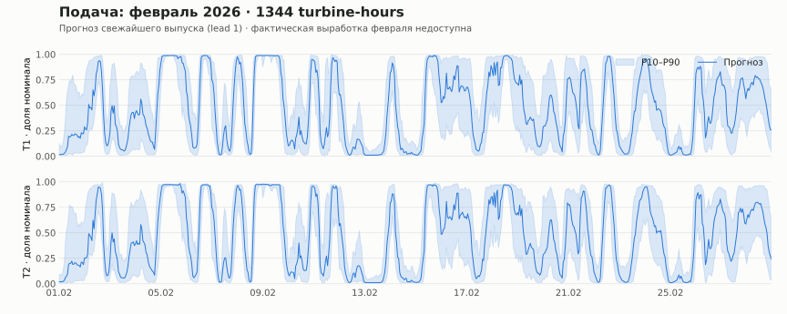
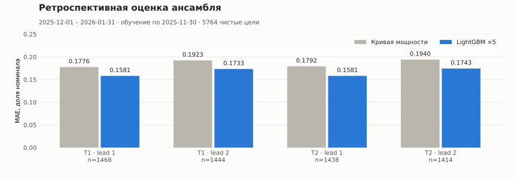
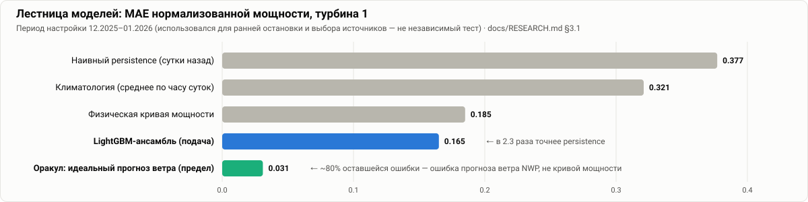
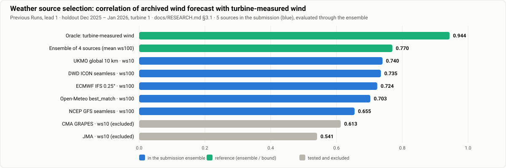
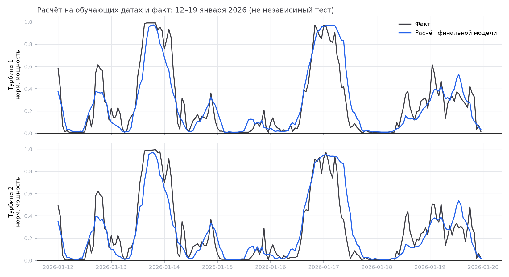
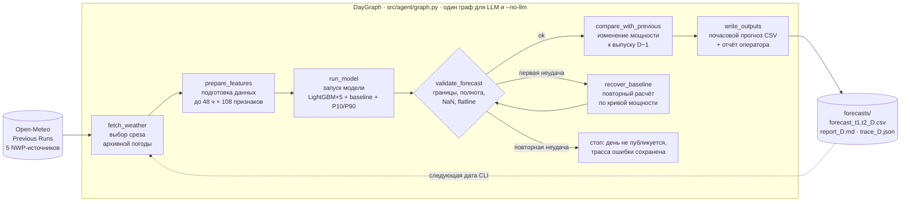
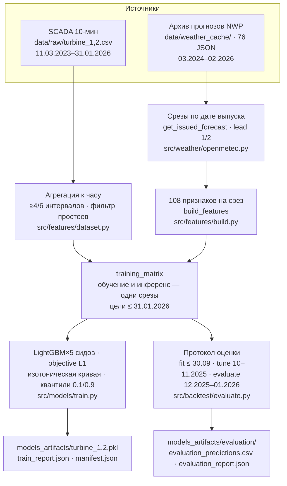

<div align="center">

# 🌬️ WindCast Agent

### Agentic AI для почасового прогнозирования выработки ВЭС на 24–48 часов

[](requirements.txt)
[](src/models/train.py)
[](src/weather/openmeteo.py)
[](src/agent/llm.py)
[](tests/)
[](forecasts/submission.csv)
[](docker-compose.yml)

**HackAlem AI 2026 · трек Energy · кейс «Agentic AI для прогнозирования выработки ВЭС» · команда KnewIT 3**

[Проверка за 5 минут](#-судьям-проверка-за-5-минут) ·
[Соответствие ТЗ](#-соответствие-тз-матрица-трассируемости) ·
[По критериям оценки](#-по-критериям-оценки) ·
[Результаты](#-результаты) ·
[Архитектура](#️-архитектура) ·
[Запуск](#-запуск) ·
[Структура](#️-структура-репозитория) ·
[Ограничения](#️-ограничения-честно) ·
[Развитие](#-потенциал-развития-и-оригинальность)

</div>

---

**WindCast Agent** — агентная система, которая для двух ветротурбин Шелекского ветрокоридора
(Алматинская область; координаты из ТЗ) **самостоятельно выполняет полный цикл прогноза**:
получает **архивные прогнозные поля** (Open-Meteo *Previous Runs API*,
5 источников NWP) → строит 108 признаков → прогоняет ансамбль LightGBM×5 с резервной кривой мощности →
формирует **почасовой прогноз на 24–48 часов** с интервалом P10–P90 → **валидирует и анализирует** результат →
сравнивает с предыдущим выпуском и **повторяет цикл для каждой запрошенной даты**.
Тестовый период организаторов — **1–28 февраля 2026**, rolling-выпуски с 31 января.
Оркестратор — LLM с типизированными инструментами (по умолчанию OpenAI `gpt-6-luna`); тот же граф
исполняется детерминированно в режиме `--no-llm`, поэтому **проверка не требует наших API-ключей и сети**.

**Граница текущей реализации:** CLI воспроизводит даты из заданного диапазона; наблюдателя за обновлениями
погоды и планировщика нет. Previous Runs сшивает несколько прогонов, а задержка публикации может вынести
часть значений за конец дня D: доступность всего среза к историческому часу выпуска **не доказана**
([аудит погодного входа](docs/FEATURE_AVAILABILITY.md)).

<details>
<summary><b>🇬🇧 English summary (for international judges)</b></summary>

WindCast Agent is an agentic AI system that forecasts hourly power output of two wind turbines
(Shelek wind corridor, Kazakhstan) for the next two calendar days. For every requested issue day it runs a loop:
fetch **archived forecast fields** (Open-Meteo Previous Runs API, 5 NWP sources) → build 108 features →
run a LightGBM×5 ensemble with an isotonic power curve available for recovery → produce an hourly forecast with P10–P90
bands → validate & analyse → compare with yesterday's issue → repeat for the next issue.
The submission for 1–28 February 2026 (`forecasts/submission.csv`, 1344 turbine-hours) is produced by
28 rolling issues from 31 Jan to 27 Feb: 48 hours each, except the final issue's 24 hours at the archive boundary.
An LLM (OpenAI `gpt-6-luna` by default; Claude / NVIDIA NIM
supported) orchestrates typed tools through a shared state graph; `--no-llm` executes the identical graph
deterministically, so judges can reproduce the forecasts offline without keys. Retrospective evaluation
(models trained through 30 Nov 2025, evaluated Dec 2025–Jan 2026): MAE 0.157 (0–24 h) / 0.173 (24–48 h)
of rated capacity on eligible targets, approximately 10–12 % lower than the power-curve baseline.
These months previously informed model choices; this is not an untouched test. February ground truth is held
by the organisers. Historical availability at a fixed issue time remains unverified: Previous Runs stitches
model runs, and publication delays can push some fields beyond day D. The CLI has no live weather watcher.

</details>

## 📌 Статус проекта

<!-- Обновлять при каждом изменении состояния. Столбец «Подтверждение» — файл или команда, а не слова. -->

| Компонент | Статус | Подтверждение |
| --- | --- | --- |
| Подача за февраль 2026 (28 выпусков, 1344 строки) | ✅ готова | [`forecasts/submission.csv`](forecasts/submission.csv), `python -m scripts.verify_submission` |
| Обучение моделей обеих турбин (LightGBM×5 + baseline + квантили) | ✅ готово | [`models_artifacts/`](models_artifacts/), [`train_report.json`](models_artifacts/train_report.json) |
| Ретроспективная оценка ансамбля по протоколу replay | ✅ готова | [`models_artifacts/evaluation/`](models_artifacts/evaluation/), [`docs/EVALUATION.md`](docs/EVALUATION.md) |
| Агентный граф: LLM и `--no-llm`, восстановление, трассы | ✅ готов | [`src/agent/graph.py`](src/agent/graph.py), [`tests/test_agent_graph.py`](tests/test_agent_graph.py) |
| Панель оператора (Streamlit) | ✅ работает | `streamlit run app.py`, [`tests/test_app_smoke.py`](tests/test_app_smoke.py) |
| Воспроизведение из чистого клона без сети | ✅ проверено командой | [`docs/INTEGRATION.md`](docs/INTEGRATION.md#чистый-клон), [`manifest.json`](models_artifacts/manifest.json) |
| Тесты (`pytest tests/ -q`) | ✅ 69 passed | [`tests/`](tests/) |
| Канонический LLM-прогон: 28/28 трасс, `mode=openai`, `fallback=false`; GPT-6 Luna указан автором коммита | ✅ сохранён | [`forecasts/trace_*.json`](forecasts/), [происхождение](docs/INTEGRATION.md#канонические-llm-отчёты-4e6f7ce); model ID в трассах отсутствует |
| Контейнерная репетиция релиза в Linux (Docker из чистого клона) | 🔄 отдельная проверка | [`docs/NEXT_STEPS.md`](docs/NEXT_STEPS.md) |
| Калибровка интервалов P10–P90 (покрытие 65 % при номинале 80 %) | ⬜ открытая задача | [`evaluation_report.json`](models_artifacts/evaluation/evaluation_report.json) |

## ⚡ Судьям: проверка за 5 минут

Всё нужное лежит в репозитории: данные организаторов, кэш всех погодных запросов, обученные модели,
готовая подача (получена с реальным LLM-агентом, см. [статус](#-статус-проекта)). После установки
зависимостей сеть и API-ключи **не нужны**: режим `--no-llm` даёт те же числа прогноза.

```bash
python3.12 -m venv .venv && source .venv/bin/activate
pip install -r requirements.txt                       # ~1–2 мин, единственный шаг с сетью

# 1) Целостность подачи: 1344 turbine-hours, [0,1], 48 ч на выпуск (27.02 — 24 ч), свежайший выпуск на каждый час
python -m scripts.verify_submission                   # ожидается: OK: 1344 turbine-hours

# 2) Полный rolling-прогон агента за тестовый период в ОТДЕЛЬНЫЙ каталог (канонические файлы не трогаются)
python -m src.cli run-agent --start 2026-01-31 --end 2026-02-27 --no-llm --output-dir runs/judge-check
python -m scripts.verify_submission --directory runs/judge-check
python -m scripts.compare_runs --a forecasts --b runs/judge-check   # ожидается совпадение чисел

# 3) Тесты и панель оператора
python -m pytest tests/ -q                            # ожидается: 69 passed
streamlit run app.py -- --forecast-dir runs/judge-check              # http://localhost:8501
```

Что вы увидите: 28 строк `[2026-01-31] ok=True -> forecast_t1_..., forecast_t2_...`, затем сводный файл на 1344 строки.
В панели — граф выполнения агента с временем каждого узла, почасовой прогноз с полосой P10–P90, разброс пяти
NWP-источников, отчёт агента и структурированный журнал. Подробный маршрут: [`docs/JUDGE_GUIDE.md`](docs/JUDGE_GUIDE.md).

<details>
<summary><b>🔍 Один день цикла под лупой (демо-сценарий)</b></summary>

```bash
python -m src.cli run-agent --start 2026-02-10 --end 2026-02-10 --no-llm --output-dir runs/demo
cat runs/demo/report_2026-02-10.md
python -c "import json;t=json.load(open('runs/demo/trace_2026-02-10.json'));print([(s['node'],s['status'],round(s['ms'])) for s in t['trace']])"
```

Агент берёт срез, обозначенный датой **10.02.2026** (lead 1 → 11.02, lead 2 → 12.02), строит 48 × 108 признаков,
прогоняет модели обеих турбин, валидирует (границы, полнота, NaN, flatline), сравнивает прогноз мощности с выпуском 09.02,
если тот есть в том же каталоге (`mean_abs_update`, `significant_update`), и пишет CSV + отчёт + трассу.
В отдельном однодневном запуске выше предыдущего выпуска нет. Эталонная трасса этого дня из
канонического прогона: [`forecasts/trace_2026-02-10.json`](forecasts/trace_2026-02-10.json) —
шесть узлов, все `ok`, `mode=openai`, `completed=true`, `fallback=false`; точный model ID в ней не записан.

</details>

## ✅ Соответствие ТЗ: матрица трассируемости

<!-- Каждое требование ТЗ (docs/CASE.md) → где реализовано → как проверить. Добавляя функцию, добавьте строку. -->

| # | Требование ТЗ ([`docs/CASE.md`](docs/CASE.md)) | Где реализовано | Как убедиться |
| --- | --- | --- | --- |
| 1 | Построить на исторических данных модель прогнозирования почасовой выработки | [`src/features/dataset.py`](src/features/dataset.py) (агрегация SCADA к часу, фильтр простоев) · [`src/features/build.py`](src/features/build.py) (108 признаков) · [`src/models/train.py`](src/models/train.py) (LightGBM×5, изотонический baseline, квантили P10/P90) | `python -m src.cli train` → [`models_artifacts/train_report.json`](models_artifacts/train_report.json) |
| 2 | **Самостоятельно** получать по координатам ВЭС погодные прогнозы из открытых источников, **доступные на момент прогнозирования** | Получение и кэширование: [`src/weather/openmeteo.py`](src/weather/openmeteo.py), `*_previous_day1/2`, координаты из [`src/config.py`](src/config.py); `fetch_weather` выбирает срез. **Доступность всего среза к фиксированному часу D не подтверждена** | Трассы и [`data/weather_cache/`](data/weather_cache/) подтверждают вход; ограничение сшивки прогонов и публикации — [`docs/FEATURE_AVAILABILITY.md`](docs/FEATURE_AVAILABILITY.md) |
| 3 | Прогноз выработки на следующие **24–48 часов с почасовой детализацией** | `get_issued_forecast()` → 48 часов на выпуск; на границе архива 27.02 — 24 часа. Колонки `horizon_h` 1…48, `lead_day` 1/2 в дневных CSV | `python -m scripts.verify_submission` (включая исключение последнего выпуска; 1344 строки подачи) |
| 4 | **Agentic AI**: система сама выполняет цикл *получение погоды → подготовка данных → запуск модели → почасовой прогноз → анализ результата → повторный расчёт при обновлении входных данных* | `DayGraph`: `fetch_weather → prepare_features → run_model → validate_forecast → compare_with_previous → write_outputs`, резерв `recover_baseline`; [`LLM`](src/agent/llm.py) вызывает инструменты через tool calling. CLI повторяет граф по заданным датам; автоматического запуска при обновлении NWP нет | [`tests/test_agent_graph.py`](tests/test_agent_graph.py): сбой LLM, ранняя запись, восстановление, отказ публикации; трассы в [`forecasts/`](forecasts/) |
| 5 | Rolling-протокол: 31.01 → прогноз на 24–48 ч, 01.02 → новый прогноз, … по всему тесту | `python -m src.cli run-agent --start 2026-01-31 --end 2026-02-27`; сводка «свежайший выпуск на каждый час» в `_build_submission()` [`src/cli.py`](src/cli.py) | 28 трасс/отчётов/пар CSV в [`forecasts/`](forecasts/); [`submission.csv`](forecasts/submission.csv) |
| 6 | Использовать **архивные прогнозы**, а не фактическую погоду, ставшую известной позднее | Инференс видит только `*_previous_dayN`; измеренный ветер и реанализ ERA5 в признаки **не входят** (docstring [`build.py`](src/features/build.py), ADR-001); обучение и инференс используют одинаковые срезы выпуска | [`tests/test_feature_availability.py`](tests/test_feature_availability.py) (равенство и границы срезов), `python -m src.cli check-tz`, [`docs/DECISIONS.md`](docs/DECISIONS.md#adr-001) |
| 7 | Повторный расчёт при обновлении входных данных | Реализован повтор по датам через CLI. `compare_with_previous` сравнивает прогнозы **мощности** одних часов между выпусками; резерв использует физическую кривую на **том же** срезе. Наблюдатель за погодными обновлениями остаётся задачей | [`src/cli.py`](src/cli.py), [`src/agent/tools.py`](src/agent/tools.py); результат `compare_with_previous`, `retried`/`fallback` в трассах |

## 🏅 По критериям оценки

<!-- Разделы названы точно по рубрике организаторов. Каждый пункт — ссылка на артефакт. -->

<details open>
<summary><b>Соответствие задаче и работоспособность · 25</b></summary>

- Матрица выше связывает требования с кодом и отмечает два открытых пункта: время доступности погоды и запуск по событию обновления.
- Подача сформирована и проверяется независимым верификатором без ML-зависимостей: [`scripts/verify_submission.py`](scripts/verify_submission.py).
- Полный прогон воспроизведён командой из чистого клона с **заблокированной сетью**: все 1344 значения совпали с подачей при допуске 1e-9 ([`docs/INTEGRATION.md`](docs/INTEGRATION.md#чистый-клон)).
- Отказоустойчивость дня: невалидный прогноз → один резерв по кривой мощности → повторная валидация → иначе день **не публикуется** (без «тихих» нулей).

</details>

<details open>
<summary><b>Техническая реализация · 25</b></summary>

- **Архивный погодный вход**: используются прогнозные поля Previous Runs, измеренный ветер и ERA5 в инференс не входят. Историческое время публикации каждого значения требует отдельного подтверждения.
- **MOS + зависимость мощности от ветра**: LightGBM учится по прогнозной погоде и фактической мощности, учитывая их статистическую связь. Обучение и инференс используют одинаковое построение признаков; равенство распределений этим не доказано.
- **Пять источников NWP** (ECMWF IFS, NCEP GFS, DWD ICON, UKMO, Open-Meteo best_match) + согласие/разброс как признаки; ветер на доступных высотах 10/80/100/120 м, куб скорости, плотность воздуха ρ = p/(R·T), сдвиг ветра, направление, лаги/окна внутри среза, календарь, lead time. `best_match` — автоматический выбор источника, поэтому пять входов не означают пять независимых центров.
- **LLM управляет инструментами и составляет отчёт**: все 28 трасс имеют `mode=openai` и `fallback=false`; точный model ID не сохранён. Числа прогнозов совпадают с `--no-llm` при допуске 1e-9 (`scripts/compare_runs`); модель GPT-6 Luna указана автором коммита [4e6f7ce](docs/INTEGRATION.md#канонические-llm-отчёты-4e6f7ce).
- **Агент как граф состояний**, а не свободный цикл: допустимый следующий инструмент задаёт граф, LLM анализирует и пишет отчёт; сбой API продолжает день с сохранённого узла без повторных расчётов; каждый шаг — в `trace_*.json`.
- **Протокол оценки** с хронологией fit → tune → evaluate и replay по датам выпуска ([`src/backtest/evaluate.py`](src/backtest/evaluate.py)); метрики пересчитываются из сохранённого CSV.
- Заявленная логика = фактическая: контракты модулей в [`docs/ARCHITECTURE.md`](docs/ARCHITECTURE.md), решения и **отрицательные результаты** в [`docs/DECISIONS.md`](docs/DECISIONS.md) (11 ADR).

</details>

<details open>
<summary><b>README и воспроизводимость · 25</b></summary>

- Зависимости закреплены до версии ([`requirements.txt`](requirements.txt)); версии, SHA256 исходников, данных, моделей и результатов — в [`models_artifacts/manifest.json`](models_artifacts/manifest.json).
- Данные, погодный кэш (76 JSON), модели и подача закоммичены: прогон без сети и без ключей.
- Свой прогон — в `runs/<имя>` (`--output-dir`): канонические результаты не перезаписываются; сравнение — `scripts/compare_runs`.
- 69 автотестов: граф агента, LLM-адаптеры, CLI, протокол оценки, равенство признаков, пропуски погоды, отсечка обучения, верификатор, панель.
- Маршрут проверки для судей: [`docs/JUDGE_GUIDE.md`](docs/JUDGE_GUIDE.md); Docker: `docker compose up --build`.

</details>

<details open>
<summary><b>Ценность и применимость решения · 15</b></summary>

- Для подготовки заявки диспетчер получает почасовой прогноз, полосу P10–P90, сумму нормализованной мощности за 24 ч (`expected_energy_norm_24h`, эквивалентные часы полной мощности) и **сигнал изменения прогноза мощности** между выпусками (`significant_update`). Перевод энергии в МВт·ч требует номинальной мощности турбины.
- Отчёт агента написан для оператора, а не для ML-инженера; панель показывает, *почему* прогноз такой (разброс источников NWP, статус валидации).
- На ретроспективной оценке первого дня MAE составляет 15.7 % номинала; сравнение с baseline и маска допустимых целей приведены ниже.
- Рабочий прототип объединяет replay и запуск отдельного дня; эксплуатация потребует проверки времени публикации входов, планировщика, мониторинга качества и калибровки интервалов.

</details>

<details open>
<summary><b>Потенциал развития и оригинальность · 10</b></summary>

- Подход: обучение на архивных прогнозных полях; историческая диагностика с измеренным ветром дала меньшую ошибку и мотивировала исследование погодного входа. Она не устанавливает долю причин ошибки или оптимальность регрессора ([исследование](docs/RESEARCH.md#source-diagnostics)).
- Граф с явными переходами вместо фреймворка — проверяемый, воспроизводимый, с восстановлением.
- Дорожная карта будущих экспериментов: [ниже](#-потенциал-развития-и-оригинальность).

</details>

## 📊 Результаты

### Готовая подача: февраль 2026



`forecasts/submission.csv` — 1344 строки (`turbine, datetime, lead_day, power_pred`), время в шкале Asia/Almaty
как в датасете. На каждый час взят прогноз свежайшего доступного выпуска, поэтому в подаче `lead_day = 1`;
lead-2 прогнозы тех же часов лежат в дневных CSV и используются для сравнения изменений мощности.
Средняя прогнозная загрузка за месяц: T1 0.465, T2 0.463 номинала.

### Ретроспективная оценка ансамбля (честные числа)



Оценочный ансамбль обучен на целях по **30.11.2025**, проверен на **01.12.2025–31.01.2026** ровно тем же путём,
что и подача (`get_issued_forecast → build_features → predict`). Таблица использует **`clean_targets`**:
известные цели с ≥4 из 6 десятиминутных отсчётов и без эвристически выявленного простоя
([правила](docs/DATA.md)). MAE нормализованной мощности:
0.157 = средняя ошибка 15.7 % установленной мощности.

| Турбина | Горизонт | MAE ансамбля | MAE baseline | RMSE | Часов-выпусков |
| --- | --- | --- | --- | --- | --- |
| 1 | 0–24 ч | **0.1574** | 0.1776 | 0.2332 | 1468 |
| 1 | 24–48 ч | **0.1729** | 0.1923 | 0.2563 | 1444 |
| 2 | 0–24 ч | **0.1574** | 0.1792 | 0.2341 | 1438 |
| 2 | 24–48 ч | **0.1734** | 0.1940 | 0.2581 | 1414 |

Сохранено **5904 строки**, ни одного пропущенного выпуска; 48 строк lead 2 за 01.12 исключены, потому что их
выпуск предшествовал бы отсечке обучения. Покрытие P10–P90 — **65.0 %** при номинальных 80 %: интервалы пока
узковаты, это открытая задача. Метрики на всех наблюдаемых часах (включая простои) — в
[`evaluation_report.json`](models_artifacts/evaluation/evaluation_report.json).

> **Важная оговорка.** Декабрь–январь ранее использовались для выбора источников и настроек, поэтому это
> *ретроспективная* оценка, а не нетронутый тест. **Фактических данных за февраль 2026 у команды нет** —
> точность на тесте организаторов мы не изобретаем.

<details>
<summary><b>📈 Кривая мощности и LightGBM на периоде настройки</b></summary>



| Модель | Турбина 1 | Турбина 2 |
| --- | --- | --- |
| Кривая мощности (изотоническая) | 0.1849 | 0.1865 |
| **Одиночная LightGBM для настройки** | **0.1647** | **0.1662** |

Источник: текущий [`train_report.json`](models_artifacts/train_report.json), период настройки **12.2025–01.2026**.
Эти метрики использованы для ранней остановки и выбора веса; они не оценивают финальный ансамбль,
переобученный по 31.01.2026. Сохранённый вес LightGBM — 1.0 у обеих турбин: кривая мощности остаётся
baseline и резервом. Исторические persistence и оракул описаны с ограничениями в
[`docs/RESEARCH.md`](docs/RESEARCH.md#temporal-model).

</details>

<details>
<summary><b>🌍 Почему пять источников NWP, а не один</b></summary>



В историческом подборе среднее четырёх источников снизило MAE относительно одиночных источников;
JMA и CMA не вошли в выбранный набор. Пространственные градиенты давления (точки N/S/E/W)
не улучшили результат проверенной конфигурации
([ADR-007](docs/DECISIONS.md#adr-007)).

</details>

<details>
<summary><b>🖼️ Историческая иллюстрация: расчёт и факт за неделю</b></summary>



Финальная модель на её обучающих датах — иллюстрация подгонки, **не** оценка точности
(`python -m scripts.plot_holdout`).

</details>

## 🏗️ Архитектура

### Цикл одного выпуска — реализация графа



LLM (OpenAI `gpt-6-luna` по умолчанию, Claude или NVIDIA NIM — через переменные окружения) получает после
каждого вызова `next_tool`, анализирует результаты и составляет отчёт; недопустимый переход не меняет
состояние. Сбой API продолжает тот же граф с текущего узла без повторного получения погоды или запуска
модели — поведение закреплено тестами. Восстановление использует уже рассчитанную физическую кривую
на **том же** выпуске архивной погоды: повторное чтение неизменного кэша не выдаётся за обновление источника.

### Данные и обучение



### Модули и контракты

| Модуль | Назначение | Ключевой контракт |
| --- | --- | --- |
| [`src/weather/openmeteo.py`](src/weather/openmeteo.py) | Previous Runs API, JSON-кэш, срезы выпуска | `get_weather(start, end)` → `{model}__{var}__d{1\|2}`; `get_issued_forecast(issue_date, weather)` → 48 ч, на последней дате архива 24 ч |
| [`src/features/dataset.py`](src/features/dataset.py) | Почасовая агрегация SCADA, фильтр простоев | `load_hourly(turbine)` → `power`, `target`, `wind_meas` |
| [`src/features/build.py`](src/features/build.py) | Признаки, стек выпусков, отсечка целей | `build_features(slice)`; `issued_feature_stack(weather)`; `training_matrix()` → `X, y` |
| [`src/models/train.py`](src/models/train.py) | Подбор на fit/tune, 5 финальных LightGBM, baseline, квантили | `train_all(weather, artifacts_dir=None)` |
| [`src/models/predict.py`](src/models/predict.py) | Прогноз мощности и интервалов, NaN при отсутствии ветра | `predict(turbine, features)` → `power_pred, power_baseline, power_lgb, power_p10, power_p90, lead_day` |
| [`src/agent/graph.py`](src/agent/graph.py) | Состояния, переходы, трасса | `DayGraph.execute(tool, args)` → результат + `next_tool` |
| [`src/agent/tools.py`](src/agent/tools.py) | Шесть штатных инструментов, резерв + `DayContext` | операции над контекстом дня; чтение предыдущего выпуска и запись результатов |
| [`src/agent/llm.py`](src/agent/llm.py) | Адаптеры OpenAI-совместимый / Anthropic | `pick_backend()`; один инструмент за ход, повтор на 429/5xx |
| [`src/agent/loop.py`](src/agent/loop.py) | Запуск дня в режиме LLM / без LLM | `run_day_llm`, `run_day_no_llm` |
| [`src/backtest/evaluate.py`](src/backtest/evaluate.py) | Ретроспективный replay, CSV/JSON, пересчёт метрик | `--output-dir` |
| [`src/cli.py`](src/cli.py) | `train`, `run-agent`, `check-tz`, `list-models` | защита LLM-отчётов от перезаписи, сборка `submission.csv` |
| [`app.py`](app.py) | Панель оператора Streamlit + Plotly | `--forecast-dir` |

Подробнее — [`docs/ARCHITECTURE.md`](docs/ARCHITECTURE.md).

### Панель оператора

`streamlit run app.py` — граф выполнения агента с временем и статусом каждого узла, прогноз выработки с
интервалом P10–P90, разброс ансамбля NWP-источников, отчёт и структурированный журнал решений. Кнопка
«Обновить результаты» перечитывает сохранённые файлы (просмотр событий, не трансляция процесса).
Панель читает `forecasts/` либо каталог из `--forecast-dir`; незавершённый запуск скрывается.

## 🚀 Запуск

<details open>
<summary><b>Локально · Python 3.12+</b></summary>

```bash
python3 -m venv .venv && source .venv/bin/activate
pip install -r requirements.txt

python -m src.cli run-agent --start 2026-01-31 --end 2026-02-27 --no-llm --output-dir runs/judge-check
python -m scripts.verify_submission --directory runs/judge-check
python -m pytest tests/ -q
streamlit run app.py -- --forecast-dir runs/judge-check
```

Без `--output-dir` CLI пишет в `forecasts/`, без `--forecast-dir` панель читает оттуда. В offline-режиме CLI
защищает существующие LLM-отчёты; `--overwrite` явно разрешает их замену. Каталог `runs/` не попадает в git.

</details>

<details>
<summary><b>Docker</b></summary>

```bash
docker compose up --build            # обучает модели при сборке, панель на http://localhost:8501
docker compose run --rm windcast sh -c \
  'python -m src.cli run-agent --start 2026-01-31 --end 2026-02-27 --no-llm --output-dir /tmp/judge-check \
   && python -m scripts.verify_submission --directory /tmp/judge-check'
```

Каталог `forecasts/` подключён с хоста. Контейнерная репетиция из чистого клона в Linux — отдельная
проверка ([статус](#-статус-проекта)).

</details>

<details>
<summary><b>Режим LLM-агента</b></summary>

```bash
cp .env.example .env                 # OPENAI_API_KEY (или ANTHROPIC_API_KEY / NVIDIA NIM), см. комментарии в файле
python -m src.cli list-models        # какие модели доступны по вашему ключу
python -m src.cli run-agent --start 2026-02-10 --end 2026-02-10 --output-dir runs/llm-demo
streamlit run app.py -- --forecast-dir runs/llm-demo
```

Приоритет бэкендов: `LLM_BACKEND` → ключ OpenAI → `ANTHROPIC_API_KEY`. Для настоящего LLM-прогона в трассе
ожидаются `completed=true`, `fallback=false` и режим выбранного бэкенда: `mode=openai` для OpenAI-совместимого
API или `mode=anthropic` для Claude. Без ключа выполняется шаблонный отчёт по тому же графу.
Ключи — только в локальном `.env` (в `.gitignore`).

</details>

<details>
<summary><b>Дополнительные команды</b></summary>

```bash
python -m src.cli train                                    # переобучение → ЗАМЕНЯЕТ models_artifacts/
python -m src.cli check-tz                                 # лаг максимальной корреляции прогноз/факт ветра = 0
python -m src.backtest.evaluate --output-dir runs/eval     # ретроспективная оценка по протоколу
python -m scripts.compare_runs --a forecasts --b runs/x    # разница двух прогонов
python -m src.backtest.experiments                         # пространственные градиенты (ADR-007)
python -m src.backtest.prof_ideas                          # двухступенчатая калибровка (ADR-008)
```

Полный список с побочными эффектами: [`docs/EXPERIMENTS.md`](docs/EXPERIMENTS.md).

</details>

## 🗂️ Структура репозитория

```text
.
├── README.md                     ← вы здесь
├── requirements.txt              ← версии пакетов закреплены; проверено на Python 3.12.6
├── Dockerfile · docker-compose.yml · .env.example
├── app.py                        ← панель оператора (Streamlit + Plotly)
├── src/
│   ├── config.py                 ← координаты, периоды, 5 NWP-источников, переменные погоды
│   ├── cli.py                    ← train · run-agent · check-tz · list-models
│   ├── weather/openmeteo.py      ← Previous Runs API, кэш, срезы по дате выпуска
│   ├── features/dataset.py       ← SCADA → час, фильтр простоев
│   ├── features/build.py         ← 108 признаков, стек выпусков, training_matrix
│   ├── models/train.py · predict.py
│   ├── agent/graph.py · tools.py · llm.py · loop.py
│   └── backtest/evaluate.py · experiments.py · prof_ideas.py
├── data/
│   ├── raw/turbine_1.csv · turbine_2.csv     ← датасет организаторов (10 мин, 03.2023–01.2026)
│   └── weather_cache/*.json                  ← 76 сохранённых ответов Open-Meteo → офлайн-прогон
├── models_artifacts/
│   ├── turbine_1.pkl · turbine_2.pkl         ← подача: обучены по 31.01.2026
│   ├── train_report.json · manifest.json     ← метрики настройки, версии, SHA256
│   └── evaluation/                           ← оценочные модели (по 30.11.2025), CSV прогнозов, JSON метрик
├── forecasts/                                ← КАНОНИЧЕСКИЙ РЕЗУЛЬТАТ (обновляет только интегратор)
│   ├── submission.csv                        ← 1344 строки, февраль 2026
│   ├── forecast_t{1,2}_YYYY-MM-DD.csv        ← 28 × 2 CSV: 48 часов; последний выпуск — 24
│   ├── report_YYYY-MM-DD.md                  ← отчёт агента оператору
│   └── trace_YYYY-MM-DD.json                 ← трасса графа: узлы, статусы, время, next_tool
├── scripts/verify_submission.py · compare_runs.py · plot_holdout.py
├── tests/                                    ← 69 тестов (см. ниже)
└── docs/                                     ← ТЗ, архитектура, данные, решения, оценка, маршрут судьи
```

### Документация

| Документ | Что внутри |
| --- | --- |
| [`docs/CASE.md`](docs/CASE.md) | Официальное ТЗ и критерии оценки (не редактируется) |
| [`docs/JUDGE_GUIDE.md`](docs/JUDGE_GUIDE.md) | Пошаговый маршрут проверки для судей |
| [`docs/ARCHITECTURE.md`](docs/ARCHITECTURE.md) | Граф выпуска, обучение и оценка, контракты модулей |
| [`docs/DATA.md`](docs/DATA.md) | Профиль датасета, пропуски, правила агрегации и фильтра простоев |
| [`docs/RESEARCH.md`](docs/RESEARCH.md) | Источники погоды, диагностика, литература |
| [`docs/DECISIONS.md`](docs/DECISIONS.md) | 11 ADR, включая отрицательные результаты |
| [`docs/EVALUATION.md`](docs/EVALUATION.md) | Протокол ретроспективной оценки и контракт файлов |
| [`docs/FEATURE_AVAILABILITY.md`](docs/FEATURE_AVAILABILITY.md) | Доступность архивных прогнозов, одинаковые входы train/inference |
| [`docs/EXPERIMENTS.md`](docs/EXPERIMENTS.md) | Команды экспериментов и их побочные эффекты |
| [`docs/INTEGRATION.md`](docs/INTEGRATION.md) | Выполненные проверки, чистый клон, ограничения среды |
| [`docs/NEXT_STEPS.md`](docs/NEXT_STEPS.md) · [`docs/TASKS.md`](docs/TASKS.md) · [`docs/GIT_WORKFLOW.md`](docs/GIT_WORKFLOW.md) | План, владельцы, git-процесс |

## 🧪 Тесты и проверки

| Файл | Что защищает |
| --- | --- |
| [`tests/test_agent_graph.py`](tests/test_agent_graph.py) | Одинаковый граф во всех режимах; сбой LLM продолжает с сохранённого узла; ранняя запись отклоняется; неудачная валидация → один резерв или отказ публикации; ошибка инструмента не оставляет частичных файлов; неудачный повтор не переиспользует старые CSV |
| [`tests/test_agent_llm.py`](tests/test_agent_llm.py) | Параметры Chat Completions для gpt-6-luna; отказ от пакетных вызовов; продолжение после отклонённой записи |
| [`tests/test_feature_availability.py`](tests/test_feature_availability.py) | Признаки обучения = признакам инференса для того же выпуска; лаги не пересекают границу выпуска; края архива; пропуски остаются NaN |
| [`tests/test_training_cutoff.py`](tests/test_training_cutoff.py) | Будущие цели не попадают в обучение; один стек признаков на обе турбины |
| [`tests/test_evaluation_protocol.py`](tests/test_evaluation_protocol.py) | Маски fit/tune/evaluate не пересекаются; оценочные цели не влияют на модель; метрики пересчитываются из CSV; нечисловые прогнозы не исчезают |
| [`tests/test_prediction_missing_weather.py`](tests/test_prediction_missing_weather.py) | Отсутствующий ветер → NaN, а не исключение; резерв и отказ публикации |
| [`tests/test_cli_output_dir.py`](tests/test_cli_output_dir.py) | Изоляция `--output-dir`, защита LLM-отчётов, проверка трасс |
| [`tests/test_verify_submission.py`](tests/test_verify_submission.py) | Независимый верификатор подачи |
| [`tests/test_app_smoke.py`](tests/test_app_smoke.py) | Панель рендерится в обоих режимах, скрывает незавершённый запуск, читает изолированный прогон |

Перед публикацией: `python -m pytest tests/ -q` · `python -m scripts.verify_submission` · `git diff --check`.

## 🔬 Эксперименты и отрицательные результаты

<!-- Новая гипотеза → строка здесь + ADR в docs/DECISIONS.md. Числа — из артефакта, не из памяти. -->

Числа ниже сохранены в исторических ADR до исправления срезов признаков. Они описывают прежний подбор;
сопоставимых CSV для нового пересчёта этих экспериментов в репозитории нет.

| Гипотеза | Исторический результат (период настройки) | Статус |
| --- | --- | --- |
| Пространственные градиенты давления (точки N/S/E/W ±0.5°) | 0.1658 против 0.1650 | Отклонено — [ADR-007](docs/DECISIONS.md#adr-007) |
| Двухступенчатая схема: калибровка NWP → ветер, затем кривая мощности | 0.1653 / 0.1686 против 0.1650 / 0.1661 | Отклонено — [ADR-008](docs/DECISIONS.md#adr-008) |
| Признаки недавней фактической выработки | 0.1650 / 0.1645; значимость разницы не проверялась | Не использованы: фактической выработки февраля нет — [ADR-008](docs/DECISIONS.md#adr-008) |
| Источники JMA, CMA | corr 0.541 / 0.613 в диагностике отдельных источников | Не выбраны при прежнем подборе — [ADR-007](docs/DECISIONS.md#adr-007) |
| Нейросетевая временная модель (LSTM/TFT) | Прямого эксперимента не было; persistence не проверяет нейросеть | Открытый кандидат — [RESEARCH §4.1](docs/RESEARCH.md#temporal-model) |
| Фреймворк оркестрации (LangGraph и аналоги) | Явный граф с проверкой переходов и трассой покрыт тестами | Отклонено — [ADR-009](docs/DECISIONS.md#adr-009) |

В прежнем эксперименте калибровочный регрессор дал MAE ветра **1.801 против 1.779 м/с** у среднего NWP
([ADR-008](docs/DECISIONS.md#adr-008)). Это результат одной конфигурации; оптимальность среднего из него не следует.

## ⚠️ Ограничения (честно)

- **Точность за февраль 2026 неизвестна** — факт у организаторов. Все наши метрики ретроспективные.
- Декабрь–январь ранее влияли на выбор источников и настроек, поэтому оценка не является нетронутым тестом.
- **Интервалы P10–P90 недокрывают факт** (65 % при номинале 80 %) — не называть их калиброванным 80 % интервалом.
- Previous Runs сшивает прогнозы разных прогонов и не сохраняет время публикации каждой ячейки.
  С учётом задержки публикации часть выбранных значений может появляться уже после дня D; доступность
  **всего** среза к фиксированному часу выпуска не доказана ([`FEATURE_AVAILABILITY`](docs/FEATURE_AVAILABILITY.md)).
- Простои и ограничения мощности непредсказуемы по погоде: модель прогнозирует **доступную ветровую выработку**,
  а не решения диспетчера; на всех наблюдаемых часах метрики чуть иные (см. `all_observed` в отчёте оценки).
- Контейнерная репетиция релиза в Linux из чистого клона — отдельная проверка ([статус](#-статус-проекта));
  локальное воспроизведение без сети подтверждено, наличие Dockerfile само по себе не доказывает контейнерный прогон.
- Планировщик, наблюдение за обновлениями NWP, контроль дрейфа входных распределений и автоматическое
  переобучение не реализованы; `compare_with_previous` измеряет только изменение прогноза мощности.

## 🔭 Потенциал развития и оригинальность

<!-- Кандидаты упорядочены по ожидаемому выигрышу. Перенос в «сделано» — только после измерения по протоколу оценки. -->

1. **Нейросетевая NWP как дополнительный источник.** Проверить ECMWF AIFS: покрытие нужных дат,
   переменные и время публикации, затем сравнить по протоколу replay.
2. **Калибровка интервалов**: конформная поправка P10–P90 по остаткам периода настройки; целевое покрытие 80 %.
3. **Аналоговый ансамбль (AnEn)**: поиск похожих исторических прогнозных ситуаций — эмпирическая неопределённость
   и ссылки на сопоставимые часы с измеренной выработкой в отчёте агента.
4. **Признаки живой SCADA**, если оператор предоставляет их с проверяемым временем доступности;
   отдельный контроль дрейфа погодных входов и качества, затем автоматическое переобучение.
5. **Привязка к рынку балансирующей энергии**: превращение P10–P90 в заявку с учётом штрафов за небаланс.
6. **Масштабирование**: проверить схему на других турбинах и площадках с учётом пространственных различий;
   отдельно исследовать доступность архивных членов EPS и их вклад в качество интервалов.

Что объединено в текущей версии: MOS-коррекция и зависимость мощности от ветра одной моделью на *прогнозной* погоде;
диагностика «оракула», направившая усилия в погодный вход; граф состояний с восстановлением и трассой вместо
свободного LLM-цикла; независимый верификатор подачи; протокол replay по датам выпуска с сохранённым происхождением
каждой строки.

## 📚 Данные и сторонние компоненты

<!-- Правило 5.4.4 регламента: раскрывать сторонний код, модели, данные и шаблоны. -->

- **Датасет организаторов**: `data/raw/turbine_{1,2}.csv` — 10-минутные ряды 11.03.2023–31.01.2026
  (142 360 и 149 499 строк; пропуски 6.6 % и 1.9 %, у T1 разрыв 41 день в мае–июне 2024). Правила обработки — [`docs/DATA.md`](docs/DATA.md).
- **Геолокация** из ссылок ТЗ: T1 `43.645150, 78.535604`, T2 `43.643198, 78.538828` (~300 м → одна точка погоды, модели раздельные).
- **Погода**: [Open-Meteo Previous Runs API](https://open-meteo.com/en/docs/previous-runs-api); ответы, используемые сохранённым прогоном, лежат в `data/weather_cache/`.
- **Библиотеки**: pandas, NumPy, scikit-learn, LightGBM, httpx, Streamlit, Plotly, matplotlib, pytest, OpenAI-совместимый HTTP-клиент, anthropic SDK.
- **LLM в продукте**: модель по умолчанию `gpt-6-luna` (OpenAI Chat Completions, tool calling); адаптеры Claude и NVIDIA NIM. Точный ID модели канонического запуска не записан в трассах.
- **AI-ассистенты разработки**: OpenAI Codex CLI и Claude Code — по правилам хакатона; архитектура, ML-решения и проверки — за командой.
- Литература: Glahn & Lowry (1972) MOS; Hong et al. (2016) GEFCom2014; Giebel & Kariniotakis (2017); Draxl et al. (2015) — [`docs/RESEARCH.md`](docs/RESEARCH.md#5-литература-исходного-исследования).

## 🧭 Как расширять этот README

Проект продолжает развиваться; README устроен так, чтобы правки были локальными:

- **Изменилось состояние компонента** → одна строка в [Статусе проекта](#-статус-проекта) (✅ / 🔄 / ⬜) со ссылкой на артефакт.
- **Новая функция по ТЗ** → строка в [матрице трассируемости](#-соответствие-тз-матрица-трассируемости): требование → файл → команда проверки.
- **Новый инструмент агента** → узел в mermaid-графе [цикла выпуска](#цикл-одного-выпуска--реализация-графа) и запись в `NODES`/`EDGES` [`src/agent/graph.py`](src/agent/graph.py).
- **Новый источник NWP или признак** → `WEATHER_MODELS`/`WEATHER_VARS` в [`src/config.py`](src/config.py), повторная оценка `src.backtest.evaluate`, обновление таблицы результатов **числами из `evaluation_report.json`**.
- **Проверенная гипотеза** → строка в [экспериментах](#-эксперименты-и-отрицательные-результаты) + ADR в [`docs/DECISIONS.md`](docs/DECISIONS.md), даже если результат отрицательный.
- **Графики** — SVG в `docs/img/`, генерируются скриптом из сохранённых CSV/JSON (не из памяти); PNG-иллюстрация — `scripts/plot_holdout.py`.
- Секции свёрнуты через `<details>`: судья видит суть на первом экране и раскрывает нужное.

<details>
<summary><b>📝 Журнал изменений</b></summary>

| Дата | Изменение |
| --- | --- |
| 23.09.2026 | Конвейер целиком: Previous Runs, признаки, LightGBM + baseline, агент, CLI |
| 23.09.2026 | Диагностика источников, отбор 5 NWP-моделей, отрицательный результат по градиентам |
| 23.09.2026 | Квантили P10/P90, полный прогон февраля, независимый верификатор подачи |
| 23.09.2026 | Единый граф состояний LLM/offline, восстановление, изоляция прогонов |
| 23.09.2026 | Признаки по срезам выпуска, протокол ретроспективной оценки, чистый клон без сети |
| 23.09.2026 | Канонический LLM-прогон после интеграции: 28/28 трасс `mode=openai`; GPT-6 Luna указан автором, числа совпадают с `--no-llm` |
| 23.09.2026 | README для судей: матрица трассируемости, графики из артефактов, статус проекта |

</details>

## 👥 Команда

**KnewIT 3** — 3 разработчика. Разделение работ: [`docs/TASKS.md`](docs/TASKS.md); git-процесс и правило владельца
прогона: [`docs/GIT_WORKFLOW.md`](docs/GIT_WORKFLOW.md). Репозиторий: <https://github.com/BAITC-Hacks/hack-f0ab74e4-knewit-3>.
