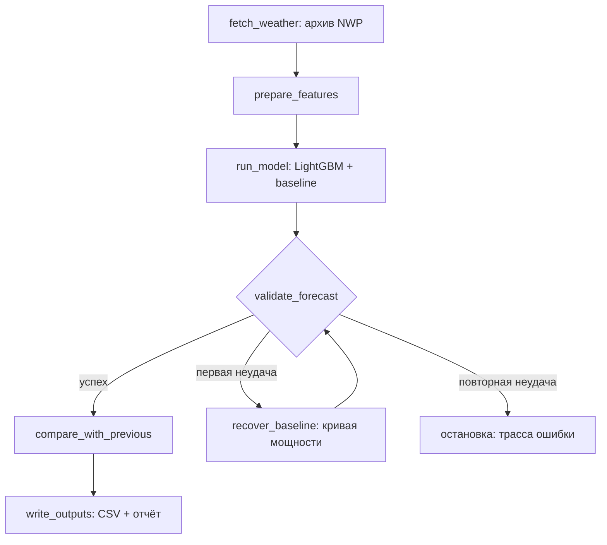

# WindCast Agent — Agentic AI прогноз выработки ВЭС

Команда **KnewIT 3** · HackAlem AI 2026, кейс «Agentic AI для прогнозирования выработки ВЭС».

Агентная система, которая для двух ветротурбин Шелекского коридора (Алматинская область)
самостоятельно выполняет полный цикл: получает **архивные прогнозы погоды, доступные на момент
прогнозирования** → готовит данные → прогоняет ML-модель → формирует почасовой прогноз выработки
на 24–48 часов → валидирует и анализирует результат → пересчитывает при обновлении входных
данных. Тестовый период: 1–28 февраля 2026, rolling-запуски с 31 января.

**Готовый результат:** [`forecasts/submission.csv`](forecasts/submission.csv) — почасовой
прогноз обеих турбин на весь февраль 2026 (1344 строки, на каждый час — прогноз свежайшего
доступного запуска), плюс прогнозы и отчёты 28 дневных запусков в [`forecasts/`](forecasts/).


Изображение использует финальную модель на её обучающих датах. Это иллюстрация,
а не независимая проверка точности (подробнее в разделе метрик).

## Где что находится

| Что посмотреть | Путь |
| --- | --- |
| Запуск и панель | `src/cli.py`, `app.py` |
| Граф агента и адаптеры LLM | `src/agent/` |
| Погода, признаки, обучение | `src/weather/`, `src/features/`, `src/models/` |
| Исходные данные и архив NWP | `data/raw/`, `data/weather_cache/` |
| Итоговые CSV, отчёты и трассы | `forecasts/` |
| Артефакты модели и метрики подбора | `models_artifacts/` |
| Проверки и эксперименты | `tests/`, `scripts/verify_submission.py`, `src/backtest/` |
| Ограничения и следующие задачи | [План](docs/NEXT_STEPS.md), [решения](docs/DECISIONS.md) |

## Ключевые идеи

1. **Честные архивные прогнозы, а не фактическая погода.** Open-Meteo *Previous Runs API*:
   переменные `*_previous_day1/2` — значения из прогона погодной модели, выпущенного за 1–2
   дня до валидного часа. Ровно то, что было бы доступно оператору ВЭС в момент
   прогнозирования; фактическая погода в инференс попасть не может по построению.
2. **Модель обучена на прогнозной погоде, а не на измеренной.** Обучающая матрица собрана
   из архивных прогнозов (03.2024–01.2026), сматченных с фактической выработкой. Модель
   одновременно выучивает кривую мощности турбины и систематические ошибки погодных моделей
   (MOS-коррекция и power curve в одном шаге) — обе стадии используют прогнозную погоду.
   Согласование временных окон признаков между обучением и инференсом требует отдельной проверки (см. план ниже).
3. **Ансамбль из 5 NWP-источников** (ECMWF, NCEP/GFS, DWD/ICON, UKMO, best_match),
   отобранных по корреляции с измеренным на турбине ветром; согласие/разброс ансамбля —
   отдельные фичи. Диагностика показала: кривая мощности почти идеальна (оракул MAE 0.031),
   вся ошибка приходит из прогноза ветра — поэтому усилен именно погодный вход.
4. **Agentic-цикл на LLM** с типизированными тулами и полной автономией дня: получение
   погоды → фичи → модель → валидация (границы, полнота, аномалии) → сравнение со вчерашним
   запуском → отчёт оператора. По умолчанию — OpenAI `gpt-6-luna`; альтернативы —
   Claude или OpenAI-совместимый NVIDIA NIM. Режим `--no-llm` выполняет цикл детерминированно —
   проверка не требует наших ключей.

## Метрики при подборе модели (декабрь 2025 + январь 2026)

MAE/RMSE нормализованной мощности, по часам. Мощность нормализована на номинал,
поэтому MAE напрямую читается как NMAE в долях от установленной мощности.

| Модель | Турбина 1 | Турбина 2 |
| --- | --- | --- |
| Наивный persistence (значение сутки назад) | 0.377 | 0.376 |
| Климатология (среднее по часу суток) | 0.321 | 0.318 |
| Физическая кривая мощности (изотоническая) | 0.185 | 0.186 |
| **LightGBM + baseline (этап подбора)** | **0.165** | **0.166** |
| — из них горизонт 0–24 ч | 0.157 | 0.157 |
| — из них горизонт 24–48 ч | 0.173 | 0.175 |
| Оракул (идеальный прогноз ветра) — предел | 0.031 | — |

Модель в 2.3 раза точнее persistence; RMSE (blend) — 0.243 / 0.249.
Эти оценки получены на временной валидации, использованной для early stopping, выбора
источников и веса бленда. Это не независимый тест. Таблица относится к этапу подбора
одного LightGBM; финальные пять моделей дообучены на данных до 31.01.2026. Февральские
целевые значения недоступны команде. Отдельная оценка финального ансамбля и согласование
признаков по времени выпуска — задачи P0 в [плане следующих шагов](docs/NEXT_STEPS.md).

## Быстрый старт

Данные организаторов и кэш всех погодных запросов уже в репозитории —
**обучение и прогноз без LLM работают из локального кэша.**
Первичная установка Python-зависимостей и сборка Docker требуют загрузок; LLM-режиму
нужны сеть и API-ключ.

В репозитории сохранены LLM-отчёты команды (прогон `e38bf10`). Для офлайн-проверки
в своей копии примеры ниже явно используют `--overwrite`: он разрешает заменить отчёты
шаблонными. Без этого флага CLI защищает существующие LLM-отчёты от `--no-llm`.
Канонические результаты команды не следует пересчитывать параллельно — см.
[правило владельца прогона](docs/GIT_WORKFLOW.md).

### Вариант 1: Docker (одна команда)

```bash
docker compose up --build
```

Образ сам обучает модели при сборке и поднимает панель оператора на
**http://localhost:8501**. Прогнозы пишутся в `forecasts/` на хосте.
Прогнать rolling-период внутри контейнера:

```bash
docker compose run --rm windcast python -m src.cli run-agent \
  --start 2026-01-31 --end 2026-02-27 --no-llm --overwrite
```

### Вариант 2: локально, Python 3.11+

```bash
python3 -m venv .venv && source .venv/bin/activate
pip install -r requirements.txt

# 1. Обучение моделей обеих турбин + метрики валидации (~2 минуты, CPU)
python -m src.cli train

# 2. Rolling-прогон всего тестового периода (28 запусков, детерминированный режим)
python -m src.cli run-agent --start 2026-01-31 --end 2026-02-27 --no-llm --overwrite

# 2'. То же с LLM-агентом (OPENAI_API_KEY в .env — см. .env.example)
python -m src.cli run-agent --start 2026-01-31 --end 2026-02-27

# Проверка корректности склейки таймзон (лаг максимальной корреляции = 0)
python -m src.cli check-tz

# 3. Панель оператора: граф выполнения агента, прогноз с интервалом, погодный ансамбль
streamlit run app.py

# 4. Независимая проверка подачи: полнота 1344 часов, границы [0,1], горизонты,
#    и что в submission.csv действительно попал прогноз свежайшего запуска
python -m scripts.verify_submission
python -m pytest tests/ -q
```

Верификатор написан отдельно от конвейера и не использует ни ML-библиотек, ни сети —
он перепроверяет результат по сырым CSV, а не повторяет логику, которая их породила.

Результат: `forecasts/forecast_t{1,2}_{дата}.csv` на каждый день, отчёты агента
`forecasts/report_{дата}.md` и сводный `forecasts/submission.csv`
(колонки `turbine, datetime, lead_day, power_pred`; время — Asia/Almaty, как в датасете).

### Демо-сценарий (один день цикла)

```bash
python -m src.cli run-agent --start 2026-02-10 --end 2026-02-10 --no-llm --overwrite
```

Агент берёт архивный прогноз, доступный 10.02.2026, строит 108 фич, прогоняет модели обеих
турбин, валидирует прогноз, сравнивает со вчерашним запуском (дрейф входа) и пишет
CSV + отчёт о своих шагах в `forecasts/report_2026-02-10.md`.

## Архитектура

LLM и `--no-llm` используют один **граф состояний** — `DayGraph` в
`src/agent/graph.py`. Граф хранит контекст дня, проверяет порядок инструментов и
сохраняет каждый шаг в `forecasts/trace_<дата>.json`. LLM получает `next_tool`,
анализирует результаты и составляет отчёт. При сбое API исполнение продолжается
с текущего узла без повторного получения погоды или запуска модели.



Восстановление использует уже рассчитанный физический baseline на **том же выпуске
архивной погоды**. Повторное чтение неизменного кэша не выдаётся за обновление источника.
После восстановления прогноз проверяется снова; интервалы ансамбля к нему не применяются.
При ошибке инструмента или повторной неудачной валидации CLI завершится с ошибкой,
сохранив трассу. Ранее записанные файлы этой даты остаются на диске, но панель скрывает
их при незавершённом запуске, а сборка февральской подачи требует успешно повторить
такой день. Ошибки выпусков вне диапазона 31.01–27.02 не блокируют февральскую подачу.

LLM по умолчанию — OpenAI GPT-6 Luna; также доступны Claude и NVIDIA NIM.
Без ключа используется шаблон отчёта и тот же граф. Его поведение проверяется в
`tests/test_agent_graph.py`, включая сбой LLM, раннюю запись и резервный расчёт.

### Панель оператора

`streamlit run app.py` — граф выполнения агента с временем и статусом каждого узла,
прогноз выработки с интервалом P10–P90, разброс ансамбля NWP-источников и журнал
решений агента. Кнопка «Обновить результаты» перечитывает сохранённые CSV, отчёт и
трассу; это просмотр событий, а не автоматическая трансляция работающего процесса.
Историческая иллюстрация показывает факт и расчёт финальной модели на её обучающих
датах — её MAE нельзя использовать как независимую оценку качества.

Подробности: [`docs/ARCHITECTURE.md`](docs/ARCHITECTURE.md) (модули, контракты),
[`docs/RESEARCH.md`](docs/RESEARCH.md) (диагностика источников, литература),
[`docs/DATA.md`](docs/DATA.md) (профиль данных, чистка), [`docs/DECISIONS.md`](docs/DECISIONS.md)
(10 ADR, включая отрицательные результаты), [`docs/CASE.md`](docs/CASE.md) (ТЗ).

## Данные и сторонние компоненты

- Датасет организаторов: `data/raw/turbine_{1,2}.csv` — 10-минутные ряды 11.03.2023–31.01.2026
  (ветер, нормализованная мощность, температура). Агрегация к часу: ≥4/6 интервалов,
  простои (мощность ~0 при рабочем ветре) исключены из обучения — правила в `docs/DATA.md`.
- Геолокация — из ссылок организаторов: T1 43.645150, 78.535604; T2 43.643198, 78.538828
  (расстояние ~300 м → одна точка погоды, модели раздельные).
- Погода: [Open-Meteo](https://open-meteo.com) Previous Runs API (некоммерческая лицензия),
  все ответы закэшированы в `data/weather_cache/` и закоммичены — воспроизводимость офлайн.
- Библиотеки: pandas, LightGBM, scikit-learn, httpx, matplotlib, anthropic SDK.

## Что проверяли и отклонили

Решения принимались замерами на holdout, а не по правдоподобности. Отрицательные
результаты сохранены в `docs/DECISIONS.md` — они объясняют, почему архитектура именно такая.

| Гипотеза | Результат | Вердикт |
| --- | --- | --- |
| Пространственные градиенты давления (точки N/S/E/W ±0.5°) | 0.1658 против 0.1650 | Отклонено (ADR-007) |
| Двухступенчатая схема: калибровка NWP → ветер, затем кривая мощности | 0.1653 / 0.1686 против 0.1650 / 0.1661 | Отклонено (ADR-008) |
| Признаки недавней фактической выработки | 0.1650 / 0.1645 — на уровне шума | Неприменимо: датасет обрывается 31.01 (ADR-008) |
| Фреймворк оркестрации (LangGraph и аналоги) | Общий граф с проверкой переходов и трассой | Отклонено (ADR-009) |

Показательный факт из проверки калибровки: обученный регрессор предсказывает ветер на
площадке **хуже**, чем простое среднее ансамбля NWP (1.801 против 1.779 м/с). Среднее
ансамбля уже близко к оптимальной оценке, а двухступенчатая схема прогоняет 108 признаков
через скалярное горлышко и теряет информацию.

## Ограничения и развитие

Приоритеты, файлы и критерии готовности: [план следующих шагов](docs/NEXT_STEPS.md).
План включает проверку ML-оценки, очистку комментариев и документации, упаковку репозитория
для судей и репетицию запуска из чистого клона.

- Простои и ограничения мощности непредсказуемы по погоде — модель прогнозирует
  доступную ветровую выработку, а не решения диспетчера.
- Признаки недавней выработки в реальной эксплуатации доступны (у оператора живая SCADA)
  и дадут небольшой выигрыш; в этом бэктесте их взять неоткуда — история кончается 31.01.2026.
- Дальше по ценности: расширение ансамбля NWP (там сидит почти вся оставшаяся ошибка),
  автоматическое переобучение при дрейфе погодных моделей, привязка интервала P10–P90
  к заявкам на рынок балансирующей энергии.

## Команда

KnewIT 3, 3 разработчика. Разделение работ: `docs/TASKS.md`, git-процесс: `docs/GIT_WORKFLOW.md`.
