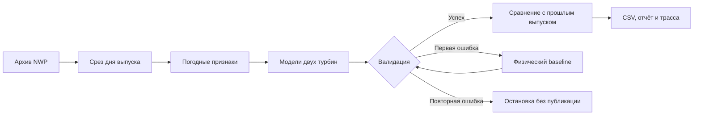

# Архитектура WindCast

## Прогноз одного выпуска

Один `DayGraph` и `DayContext` обслуживают LLM и `--no-llm`. LLM вызывает инструменты
и пишет анализ; допустимый следующий шаг задаёт граф. Offline-режим проходит тот же
путь и создаёт шаблонный отчёт. Резервный расчёт использует уже полученную погоду:
`power_pred` заменяется `power_baseline`, интервалы ансамбля удаляются. Пропавший ветер
остаётся NaN, поэтому baseline также не может пройти проверку без данных.

Сбой LLM продолжает тот же контекст детерминированно. Ошибка вычислений завершает день.
После каждого шага записывается `trace_{issue_date}.json`: режим, завершённость,
валидация, повтор baseline (`retried`), отказ LLM (`fallback`), ошибка и события переходов.
Неправильный порядок вызова не меняет состояние. При неудачном повторном запуске старые
CSV могут остаться на диске, но UI скрывает их, а сборка подачи проверяет статус трассы.

## Обучение и оценка

`issued_feature_stack(weather)` вызывает `build_features(get_issued_forecast(D, weather))`
по дням выпуска. Таким образом лаги и окна обучения считаются внутри тех же срезов, что
в ежедневном прогнозе. Стек переиспользуется обеими турбинами. `training_matrix()` возвращает
`X, y` с индексом целевого часа; один час может встречаться с lead 1 и lead 2. Необязательные
`stack`, `target_end` и `with_meta` позволяют переиспользовать признаки, ограничить цели
и получить происхождение строки. Подробности — [FEATURE_AVAILABILITY](FEATURE_AVAILABILITY.md).

Финальная подача использует модели по 31.01.2026. `train_report.json` описывает настройку.
Отдельный `src.backtest.evaluate` обучает ту же конфигурацию по 30.11.2025 и воспроизводит
оценочные декабрь–январь через ежедневный путь. CSV сохраняет каждую пару выпуск/целевой час;
отчёт содержит границы, полноту и метрики. Выпуски раньше отсечки обучающей модели исключены.
Результаты и отдельные модели лежат в `models_artifacts/evaluation/`.

Это ретроспективная оценка: исследовательские решения уже учитывали декабрь–январь.
Доступность всего погодного среза к фиксированному часу выпуска также не доказана:
Previous Runs не возвращает время публикации. Одинаковые признаки обучения и прогноза
не снимают это ограничение. Февральского факта у команды нет.

## Модули и контракты

| Модуль | Назначение |
| --- | --- |
| `src/weather/openmeteo.py` | Previous Runs, JSON-кэш, срезы выпуска и проверка индекса |
| `src/features/dataset.py` | Почасовая агрегация SCADA, полнота и фильтр предполагаемого простоя |
| `src/features/build.py` | Погодные/аэродинамические признаки, стек выпусков и отсечка целей |
| `src/models/train.py` | Подбор на fit/tune, пять финальных LightGBM, baseline и квантили |
| `src/models/predict.py` | Прогноз мощности и интервалов, сохранение отсутствующего ветра как NaN |
| `src/backtest/evaluate.py` | Ретроспективный replay, сохранение CSV и пересчёт метрик |
| `src/agent/` | Общий граф, инструменты, LLM-провайдеры и отчёт |
| `src/cli.py` | Обучение, запуск диапазона дней, проверка таймзоны и списка моделей |
| `app.py` | Streamlit: графики, отчёты и сохранённые трассы |

`get_weather(start, end, models=None)` возвращает naive DatetimeIndex в локальной
шкале Asia/Almaty и колонки `{model}__{var}__d{1|2}`; ветер — м/с.
`get_issued_forecast(issue_date, weather)` выбирает D+1/lead 1 и D+2/lead 2, заполняя
отсутствующие часы внутри дня NaN. На последнем дне архива доступен только lead 1.

`predict(turbine, features, artifacts_dir=None)` читает выбранные артефакты и возвращает
`power_pred`, `power_baseline`, `power_lgb`, опциональные `power_p10`, `power_p90` и `lead_day`.
`train_all(weather, artifacts_dir=None)` сохраняет модели и отчёт в выбранном каталоге.
Значения по умолчанию сохраняют прежние интерфейсы. Владение файлами — [TASKS](TASKS.md).

## Каталог прогона и среда

`run-agent --output-dir runs/check` передаёт путь через исполнитель в `DayContext`.
В выбранный каталог записываются дневные CSV, отчёты, трассы и submission; предыдущий
выпуск для сравнения читается оттуда же. Модели и погодный кэш остаются стандартными
входами проекта. Панель выбирает результаты через `--forecast-dir runs/check`.

Диапазон 31.01–27.02.2026 даёт 28 выпусков. Подача выбирает минимальный lead для каждого
из 1344 turbine-hours февраля. Проверка формата не оценивает качество мощности.

Python 3.12+, CPU, закреплённые версии в `requirements.txt`. Ключи — только в окружении
или локальном `.env`; offline-режиму ключ не нужен. Выполненные проверки и остающиеся
ограничения среды — [INTEGRATION](INTEGRATION.md), команды запуска — [JUDGE_GUIDE](JUDGE_GUIDE.md).
